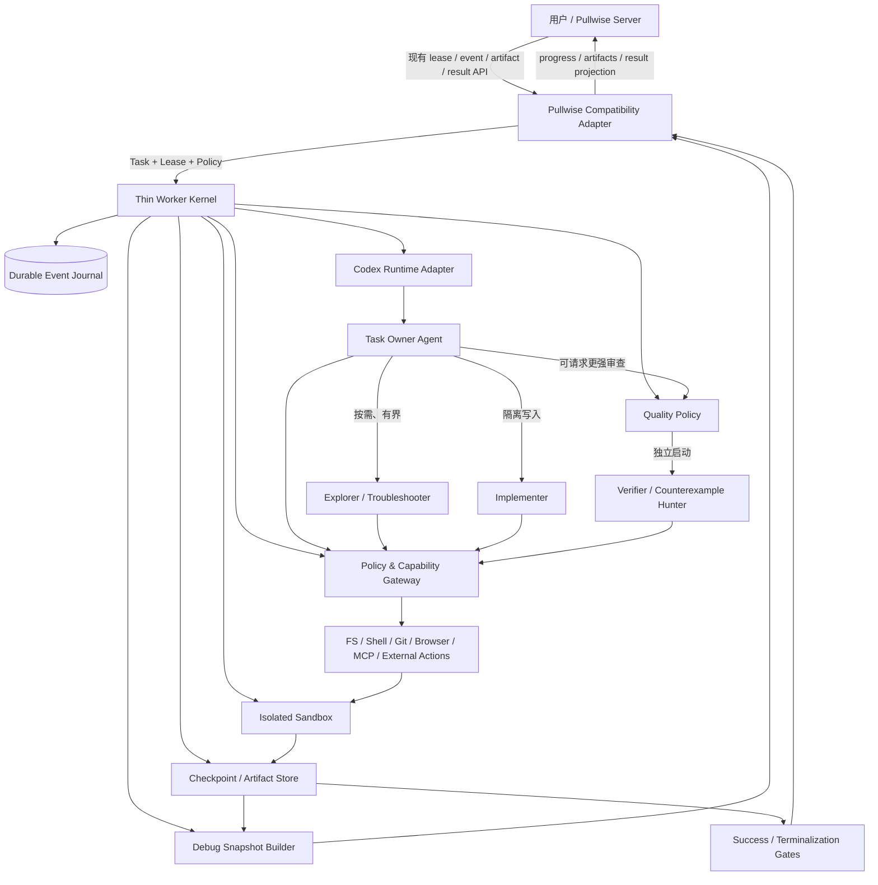
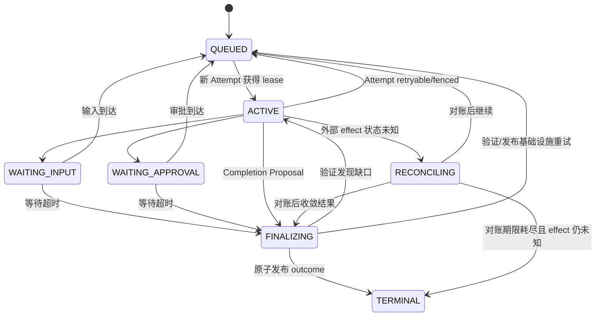
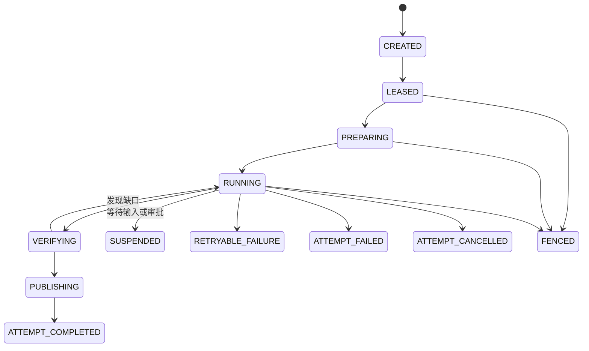
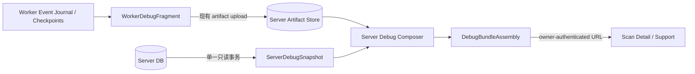

# Agent-First 轻量工程 Worker 设计

> 状态：Proposed（目标态架构）  
> 日期：2026-07-16  
> 范围：面向任意软件工程任务的 Worker；本文不以当前 Worker 实现为设计起点。Agent-First 切换在 Worker、Server、Web 间采用协调 clean break，不保留现有产品契约兼容层。

<!-- BEGIN AGENT-FIRST DECISION REFS: TARGET_AUTHORITY_SCOPE -->
<!-- D1@sha256:ab117e7c86472b7ce57bf2433978df0efe1299353ad747b7eabbff723fec469a -->
<!-- D27@sha256:f3ef27ad6318d4da20d4750cdde9387b66045f1708a909b57aba1c6e48ec2b0e -->
<!-- END AGENT-FIRST DECISION REFS: TARGET_AUTHORITY_SCOPE -->

## D27 clean-break override（Normative）

D27 是本文跨章节的高优先级约束：目标态只允许一套 current Agent-First
contract。后文凡要求 Pullwise Compatibility Adapter、旧协议/路由、DTO alias、
双读写、shadow、fallback、protocol downgrade、旧数据 migration/backfill 或
old/new 共存矩阵的内容，均为待删除的历史设计清单，不是实现目标或发布回滚路径。
该覆盖同样适用于第 3 节架构图、第 17 节路线、第 18 节完成判据和第 19 节 ADR；
其中的兼容接入、旧 API fallback 或 old/new 验收不得作为 implementation authority。
协调切换仍必须保持安全、权限、租约、fencing、持久化、幂等、审计和正确性
不变量；尚未 resolved 的决策继续阻断相应实现，不能由 clean break 推断答案。

## 0. 结论先行

推荐把 Worker 设计成一个包裹 Codex 的“确定性执行微内核”，而不是一个理解 Python、C++、前端、后端的工作流引擎。

核心公式是：

> **语义交给 Agent，约束交给 Worker，结论交给证据。**

这里应最大化的是 **Agent 的责任范围**，不是同时运行的 Agent 数量：

- Codex Agent 负责理解目标、探索陌生工程、规划、选择工具、实现、诊断、验证、复盘和按需分工。
- Worker 只固化概率模型不应承担的系统不变量：租约、状态、隔离、权限、预算、取消、检查点、审计、幂等发布和完成门禁。
- 脚本可以成为 Agent 的临时“手脚”，也可以实现 hash、归档、进程终止等确定性机制，但不能成为按技术栈分支的“流程大脑”。
- 每个任务由一个持久的 `Task Owner` Codex Agent 端到端负责；只在确有独立性、并行收益或审查价值时派生有界子 Agent。
- Worker 不硬编码构建或测试矩阵。Agent 从仓库指令、CI、构建文件和环境能力中发现应该执行什么。
- Agent 可以提出“已经完成”，但只有每项验收要求都被最终工作树上的新鲜证据覆盖后，Worker 才能发布成功结果。

最重要的架构验收标准是：

> **增加一种此前未见过的语言、框架或工程形态时，不修改默认控制面；只允许仓库自身说明或不含流程语义的 opaque 执行环境提供新工具链。可选语言 Skill 可以加速，但不得成为正确性的必需路径。**

---

## 1. 设计目标与非目标

### 1.1 目标

1. **轻量**：常驻部分只保留 Supervisor 和少量通用控制能力；工程工具链随任务进入隔离环境。
2. **Agent-first**：工程语义和下一步行动由 Codex 决定，而不是由固定 DAG、语言检测器或脚本矩阵决定。
3. **稳定可靠**：任何 Agent、进程、网络连接或 Worker 都可以失败，任务仍不会丢失、重复发布或越权。
4. **处理面广**：同一内核处理 Python、C++、Web、后端、多语言 monorepo、冷门语言和自定义构建系统。
5. **结果质量高**：以“要求—变更—验证—证据”闭环证明完成，避免 Agent 自证和 false green。
6. **成本可控**：默认单 Agent；多 Agent、长上下文和昂贵验证只在能降低不确定性或风险时启用。
7. **可审计、可恢复**：恢复依赖持久事实、工作区快照和证据，不依赖模型临时记忆或隐藏思维过程。
8. **Agent 可导航**：手写实现按内聚职责拆成有界模块，使 Agent 和审查者无需加载无关子系统即可理解、修改和验证一个行为。

### 1.2 非目标

- 不设计通用 build/test DSL。
- 不维护 `PythonPipeline`、`CppPipeline`、`FrontendPipeline` 等技术栈流程。
- 不把所有任务强行拆成固定的“分析—编码—测试—报告”阶段。
- 不通过正则解析 Agent 自然语言来驱动控制状态。
- 不让多个 Agent 无隔离地并行修改同一工作树。
- 不把任意工程任务都强行做成完全无人值守；权限、产品歧义和不可逆外部操作仍可要求人类输入。
- 不为了“全 Agent”而把租约、权限、安全、幂等和成功判定交给概率模型。

---

## 2. 设计原则与决策权

### 2.1 两条判断规则

- 回答“任务是什么意思、下一步应该做什么”的逻辑，属于 Agent。
- 回答“如何安全、可重复、可审计地执行”的逻辑，属于 Worker。

### 2.2 决策权矩阵

| 事项 | 最终负责人 | 说明 |
|---|---|---|
| 理解目标、补充派生验收条件 | Task Owner | 不得删除或缩窄用户明确要求 |
| 识别仓库结构和技术栈 | Agent | Worker 只暴露文件与环境事实 |
| 选择命令、工具和验证方法 | Agent | 优先使用仓库原生约定 |
| 是否以及如何创建探索/实施子 Agent | Task Owner | 受并发、深度、预算硬上限约束 |
| 是否满足独立验证编制 | Worker Quality Policy | Task Owner 可请求加强，不能降低风险 floor |
| 修改、调试、解释失败 | Agent | 失败应形成新假设，禁止机械盲重试 |
| 租约、状态、取消、重试代次 | Worker | 使用持久状态和 fencing |
| 沙箱、路径、网络、凭据、审批 | Worker Policy | Agent 可说明理由，但不能自批权限 |
| 命令超时和资源上限 | Worker | Agent 可申请受限延期，不能无限运行 |
| 原始日志、退出码、diff、截图真实性 | Worker | 保存不可变证据与内容摘要 |
| 证据是否足以说明业务目标 | Agent + 独立 Verifier | Worker 再校验证据存在性和新鲜度 |
| 最终成功发布 | Worker Publish Gate | Agent 只能提交完成申请 |

### 2.3 脚本边界

允许的脚本和确定性代码：

- 创建、冻结、快照和清理工作区。
- 执行 Agent 已选择的命令并终止完整进程树。
- 计算 hash、打包、上传、限流、脱敏和校验结构。
- 执行仓库自身已有的构建、测试、格式化或启动脚本。
- 由 Agent 在单次任务中临时生成批量编辑、数据转换或复现脚本；它们仍受沙箱、审计和验证约束。

不应进入 Worker 核心的逻辑：

- `if *.py => pytest`、`if package.json => npm test`。
- 根据文件后缀选择固定流水线或固定 Agent 角色。
- 看到某段错误日志就执行预设修复。
- 固定次数原样重跑同一失败命令。
- 只根据退出码或 Agent 的自然语言宣布成功。
- 用脚本判断缺陷是否真实、变更是否满足业务目标。

简言之：**脚本是 Agent 的手脚，不是系统的大脑。**

### 2.4 模块边界与 Agent 可处理性

Agent-first 不只要求运行时由 Agent 决策，也要求代码本身能被 Agent 稳定导航：

- 手写生产代码、测试和长期维护脚本应保持有界，按领域职责、状态/数据所有权、协议或 side-effect 边界和可独立测试行为拆分，并通过窄接口组合。
- 文件行数是上下文与评审门禁，不是架构目标。即使行数较少，职责混杂、共享可变状态或循环依赖仍不合格；不得用任意编号分片、wildcard-import 聚合或纯转发层机械达标。
- 超大遗留文件应采用 strangler 式渐进迁移：小修复不触发无关的整体重写，但新 capability 必须落入责任命名的新模块，旧文件逐步退化为 composition/compatibility seam。
- 生成物、第三方内容或工具强制的原子文件可以有受控例外，但例外必须可审计，且业务逻辑应尽量外移。

具体行数阈值、baseline ratchet、例外字段和完成证据以当前MVP第3.2节、Post-MVP不变量及各项目`AGENTS.md`为实施权威，目标设计不另复制数值，避免多处漂移。

---

## 3. 总体架构



这些是逻辑边界，不要求一开始拆成微服务。MVP 可以是一个 Worker 进程、一个轻量持久存储和一个内容寻址的制品目录。Compatibility Adapter 是产品接入边界，不进入通用 Worker 内核。

### 3.1 Thin Worker Kernel

内核只保留六类职责：

1. 原子领取任务、续租和 fencing。
2. 管理 Attempt 状态、取消、绝对截止时间和总预算。
3. 准备和销毁一次性隔离环境。
4. 代理、授权、记录和终止工具调用。
5. 持久化事件、检查点、原始事实和证据。
6. 校验完成申请并原子发布最终结果。

### 3.2 Codex Runtime Adapter

该层隔离 Codex 的具体接入方式，对内只暴露稳定能力：

- 创建、继续、恢复、中断和关闭 Thread/Session。
- 流式接收 Agent、工具、用量和终止事件。
- 传入任务契约、工作区、权限和能力清单。
- 创建有界子 Agent，并把失败明确传回 Task Owner。
- 在原会话不可恢复时，用恢复包启动新的 Task Owner。

业务状态不得依赖某个 CLI 输出格式，也不得依赖解析 Agent 自然语言。Codex 官方 SDK 已支持在同一 thread 上继续运行以及按 thread ID 恢复，这使持久 Task Owner 具备现实基础；不过恢复设计仍不能只依赖远端 thread。[Codex SDK：Usage](https://learn.chatgpt.com/docs/codex-sdk#usage)

### 3.3 Execution Sandbox

沙箱是 Agent 操作文件、运行命令、启动服务和生成产物的地方；控制状态、凭据、审计和发布权留在沙箱之外。这个“控制面与计算面分离”的边界也符合 OpenAI 官方 Agent sandbox 指南。[Sandbox Agents](https://developers.openai.com/api/docs/guides/agents/sandboxes)

### 3.4 Evidence Plane

证据面保存不可变事实：输入 revision、最终 diff、命令、退出码、完整日志、截图、HTTP transcript、测试报告、环境指纹、Verifier 结论和内容摘要。自然语言总结只是一个产物，不是事实源或控制状态。

### 3.5 Pullwise Compatibility Adapter（D27 已退役：仅删除清单）

该层只做版本协商、字段映射、状态投影和传输，不做工程语义判断。通用内核只认识 Task、Attempt、Event、Artifact 和 TaskResult；Adapter 才认识 Pullwise 的 scan、job、reviewRun、现有进度事件和 artifact API。关闭或替换该 Adapter，不应改变 Agent 执行、证据门禁、恢复或安全模型。第 13 节给出完整兼容契约。

---

## 4. Agent 执行模型

### 4.1 一个持久 Task Owner

每个 Task 只有一个长期存在的 Task Owner，负责端到端语义一致性：

1. 读取不可变的原始目标和权限边界。
2. 探索仓库、指令层级、现有改动、CI 和环境能力。
3. 形成 `Task Charter`：要求、假设、范围、风险和验收策略。
4. 决定自己执行还是委派独立子任务。
5. 集成所有写入结果，维护最终工作树的一致性。
6. 维护要求到证据的映射。
7. 提交 `Completion Proposal`，但不能直接把 Task 标为成功。

采用单一负责人而不是平权 swarm，是为了避免目标漂移、重复工作和无人承担最终集成责任。

### 4.2 Agent 自适应循环

Worker 不硬编码语义阶段，Task Owner 在同一个可修订循环中工作：

```text
Observe → Form/Revise Plan → Act or Delegate → Verify → Reflect
                  ↑                                  │
                  └──────── evidence / failure ──────┘
```

不同任务可以省略某些动作：文档问答可能只读，环境诊断可能不改代码，小修复无需专门 Planner，大型跨模块任务才需要并行探索和独立实现 lane。

### 4.3 动态子 Agent

执行型子 Agent 是按需的责任合同，不是固定流水线。常见责任模板包括：

- `Explorer`：只读定位组件、调用链、约束和权威命令。
- `Troubleshooter`：对失败证据建立新假设、最小化复现。
- `Implementer`：在限定文件范围和隔离 worktree 中完成一个纵向结果。
- `Verifier`：从原始要求、最终 diff 和证据独立寻找反例；用于完成门的 Verifier 由 Quality Policy 启动，不由 Task Owner 自选。
- `Reviewer`：关注安全、接口兼容、并发、迁移或其他特定风险。

建议默认规则：

- 小任务只启动 Task Owner。
- 优先并行只读探索、日志分析、测试选择和审查。
- 主工作树实行单写者；写型子 Agent 使用独立 worktree/branch，由 Task Owner 合并。
- 默认最大子 Agent 深度为 1；活跃数、总数和 token 都从父任务预算中扣除。
- 子 Agent 只返回结论、patch/commit、证据和风险摘要，不回传整段噪声上下文。
- 不使用多数投票代替事实证明；独立意见的价值在于发现反例。

每次委派至少说明：

```json
{
  "objective": "定位上传接口偶发 500 的根因",
  "context_refs": ["task://original", "artifact://log-42"],
  "workspace_mode": "read_only",
  "owned_scope": ["backend/upload/**"],
  "done_when": [
    "给出可复现路径或有证据的排除结论",
    "列出未排除的风险"
  ],
  "budget": { "wall_seconds": 900 },
  "return_shape": "summary + evidence + risks"
}
```

它规定结果边界，而不是规定逐步操作。

---

## 5. 最小任务与结果协议

### 5.1 外部 Task Request

外部协议应以目标为中心，而不是要求用户编写工作流：

```json
{
  "schema_version": "agent-task/v1",
  "submission_idempotency_key": "client-stable-key",
  "objective": "修复订单导出在空数据时崩溃的问题",
  "workspace": {
    "repository": "repo-ref",
    "revision": "immutable-revision"
  },
  "acceptance_criteria": [
    {
      "id": "AC-1",
      "statement": "空数据导出不再崩溃",
      "mandatory": true
    }
  ],
  "constraints": ["保留非空导出的现有行为"],
  "requested_capabilities": {
    "workspace_write": true,
    "network": "allowlist",
    "external_mutation": "approval_required"
  },
  "budgets": {
    "wall_seconds": 3600,
    "max_agents": 4,
    "max_agent_depth": 1
  },
  "delivery": {
    "output_language": "zh-CN",
    "artifacts": ["patch", "report"]
  }
}
```

业务用户只需提供 `objective` 和工作区引用；客户端 SDK/Ingress 必须生成并在提交重试时复用 `submission_idempotency_key`。它是提交去重的唯一客户端字段：同一租户下，相同 key 和相同输入摘要只创建一个 Task，相同 key 配不同输入必须报冲突。其余字段可以由产品策略给默认值。

调用方提交的是能力请求，不是授权。Worker Policy 必须据此生成独立、版本化的 `EffectiveExecutionPolicy`，至少包含实际授予的 capability、拒绝项、网络边界、预算上限、审批规则、质量风险下限和 `policy_version`。Task Owner、子 Agent 和调用方都只能请求提高能力，不能提升或改写生效策略。

### 5.2 原始请求与 Task Charter 分离

原始请求不可变。Task Owner 在只读探索后生成可修订的 Charter：

```json
{
  "schema_version": "task-charter/v1",
  "original_request_ref": "task://original",
  "requirements": [
    {
      "id": "AC-1",
      "source": "explicit",
      "statement": "空数据导出不再崩溃",
      "mandatory": true
    },
    {
      "id": "DR-1",
      "source": "derived",
      "statement": "非空数据导出行为不回归",
      "mandatory": true
    }
  ],
  "assumptions": [],
  "scope": ["backend/export/**"],
  "agent_risk_assessment": "medium",
  "verification_intent": [
    "复现原故障",
    "验证空数据行为",
    "验证非空数据回归"
  ]
}
```

Worker 同时维护一个追加式 `Requirement Ledger`：创建 Task 时把原始 objective 和所有显式验收项固定为不可删除条目；Task Owner 只能提议追加派生要求、建立 `supersedes` 关系或请求豁免。强制要求的删除、降级或豁免必须产生有权用户/策略签名的事件，原条目仍保留在审计链中。低影响且可逆的歧义可以记录假设继续；会显著改变产品行为、产生不可逆效果或扩大权限的歧义必须请求输入。

Charter 中的风险只是 Agent 建议。最终质量等级取 `max(EffectiveExecutionPolicy.risk_floor, agent_risk_assessment)`；Agent 只能提高，不能降低风险。R3/R4 capability 自动把风险下限提升为高风险。

### 5.3 Completion Proposal 与 Task Result

Task Owner 只能提交完成申请：

```json
{
  "schema_version": "completion-proposal/v1",
  "outcome_requested": "completed",
  "summary": "...",
  "requirement_assessments": [
    {
      "requirement_id": "AC-1",
      "claimed_verdict": "PASS",
      "observation_ids": ["observation://test-12", "observation://diff-8"]
    },
    {
      "requirement_id": "DR-1",
      "claimed_verdict": "PASS",
      "observation_ids": ["observation://regression-13", "observation://diff-8"]
    }
  ],
  "change_set": "artifact://diff-8",
  "unresolved": [],
  "risks": []
}
```

完成申请之后，由 Worker 的 `Quality Policy` 独立决定并启动所需 Verifier；只有低风险、无代码变更的任务可由 Policy 明确授权 Task Owner self-attestation。Task Owner 可以请求更强审查，但不能挑选更弱的 Verifier、缩小其输入或跳过风险下限。Verifier 在冻结 `SourceStateID` 的只读/COW 沙箱中工作，并输出可机械校验的证明：

```json
{
  "schema_version": "verification-attestation/v1",
  "verifier": {
    "agent_id": "verifier-7",
    "session_id": "session-ref",
    "launched_by": "quality-policy/v3"
  },
  "task_request_digest": "task-request-sha256",
  "requirement_ledger_version": 4,
  "input_manifest_digest": "verifier-input-sha256",
  "source_state_id": "source-state-sha256",
  "execution_state_ids": ["execution-state-sha256"],
  "policy_version": "policy-v12",
  "requirements": [
    {
      "requirement_id": "AC-1",
      "verdict": "PASS",
      "observation_ids": ["observation://test-12"],
      "limitations": []
    },
    {
      "requirement_id": "DR-1",
      "verdict": "PASS",
      "observation_ids": ["observation://regression-13"],
      "limitations": []
    }
  ]
}
```

最终结果状态必须诚实：

- `COMPLETED`：Requirement Ledger 中所有强制要求均为 `PASS`，不接受 waiver 冒充完成。
- `NO_CHANGE_NEEDED`：证明当前状态已满足目标，没有产生变更。
- `COMPLETED_WITH_WAIVERS`：有权用户明确接受未满足要求或残余风险；必须保留原始要求和授权审计，统计时不得并入完整成功率。
- `PARTIAL`：有可用成果，但仍有必需要求未通过或未验证。
- `BLOCKED`：缺输入、权限、环境能力或人工决定。
- `FAILED`：已确认不可恢复、验收失败且无法修正，或预算耗尽且没有安全可交付的部分成果。
- `CANCELLED`：取消已越过线性化点，之后不得发布成功结果。
- `CANCELLED_WITH_EFFECTS`：取消前已有已确认的外部 effect，结果必须逐项披露，不能描述为干净取消。
- `TERMINATED_WITH_UNKNOWN_EFFECTS`：执行与新 effect dispatch 已停止，但至少一个已发请求在有界 reconciliation deadline 后仍无法确认“发生”或“未发生”。它不是成功、失败或干净取消；必须保留原始 termination cause、逐项未知 effect、最后查询事实和人工处置要求。

最终发布的是内容不可变、可寻址的 `TaskResult`，而不是只有一个状态字符串：

```json
{
  "schema_version": "task-result/v1",
  "task_id": "task-1",
  "task_version": 12,
  "outcome": "COMPLETED",
  "reason_code": "requirements_verified",
  "task_request_digest": "task-request-sha256",
  "requirement_ledger": {
    "version": 4,
    "digest": "requirement-ledger-sha256"
  },
  "source_state": {
    "original": "source-original-sha256",
    "final": "source-final-sha256"
  },
  "execution_state_ids": ["execution-state-sha256"],
  "observation_manifest_ref": {
    "artifact_id": "art_observations_manifest",
    "sha256": "sha256:observations-manifest",
    "size_bytes": 4096,
    "schema_id": "observation-manifest/v1"
  },
  "requirements": [
    {
      "requirement_id": "AC-1",
      "verdict": "PASS",
      "observation_ids": ["observation://test-12"],
      "attestation_refs": [{
        "artifact_id": "art_verification_attestation",
        "sha256": "sha256:verification-attestation",
        "size_bytes": 2048,
        "schema_id": "verification-attestation/v1"
      }],
      "waiver_event_ref": null
    },
    {
      "requirement_id": "DR-1",
      "verdict": "PASS",
      "observation_ids": ["observation://regression-13"],
      "attestation_refs": [{
        "artifact_id": "art_verification_attestation",
        "sha256": "sha256:verification-attestation",
        "size_bytes": 2048,
        "schema_id": "verification-attestation/v1"
      }],
      "waiver_event_ref": null
    }
  ],
  "change_set_ref": {
    "artifact_id": "art_diff_8",
    "sha256": "sha256:diff-8",
    "size_bytes": 8192,
    "schema_id": "change-set/v1"
  },
  "artifacts": [{
    "artifact_id": "art_report",
    "sha256": "sha256:report",
    "size_bytes": 16384,
    "schema_id": "task-report/v1"
  }],
  "evidence_closure": {
    "manifest_ref": {
      "artifact_id": "art_evidence_closure",
      "sha256": "sha256:evidence-closure-bytes",
      "size_bytes": 3072,
      "schema_id": "evidence-closure-manifest/v1"
    },
    "digest": "sha256:JCS-sorted-evidence-closure"
  },
  "risks": [],
  "effects": {
    "confirmed_count": 0,
    "unknown_count": 0,
    "ledger_snapshot_ref": {
      "artifact_id": "art_effect_ledger_snapshot",
      "sha256": "sha256:effect-ledger-snapshot",
      "size_bytes": 1024,
      "schema_id": "effect-ledger-snapshot/v1"
    },
    "requires_human_reconciliation": false,
    "termination_cause": null,
    "reconciliation_deadline": null
  },
  "diagnostics": {
    "worker_debug_fragment": {
      "state": "uploaded",
      "sealed": true,
      "fragment_id": "debug-fragment://attempt-2/8",
      "snapshot_seq": 8,
      "sha256": "debug-fragment-sha256",
      "server_receipt_id": "debug-receipt-8",
      "sealed_at": "RFC3339",
      "reason_code": null
    }
  },
  "provenance": {
    "attempt_ids": ["attempt-2"],
    "checkpoint_generation": 7,
    "effective_policy_version": "policy-v12",
    "control_plane_digest": "control-plane-sha256",
    "evaluation_runtime_digest": "runtime-sha256"
  }
}
```

TaskResult 中所有 `*_ref/*_refs` 都必须是不可变内容引用，至少绑定 `artifact_id + sha256 + size_bytes + schema_id`；裸 storage URL、可替换 alias 或只有数据库主键的 opaque ref 无效。`EvidenceClosureManifest` 按稳定排序列出 TaskResult 可达的 ObservationManifest、每条 raw Observation artifact、Attestation、change set、report、waiver/effect ledger snapshot 及其四元组，排除 closure manifest 自身，并计算 `digest = sha256(JCS(entries))`。TaskResult 同时包含 manifest 的字节 SHA 与 closure digest，因此 TaskResult/TaskResultCore digest 传递绑定整个证据闭包，而不只是几个逻辑名称。

Publish Gate 必须读取并校验 closure 中每个已上传/本地内容寻址对象，确认 bytes、size、schema 与引用一致后才能接受；对象之后不可替换。Pullwise Adapter 可以直接用现有 artifact row 的 SHA/size/schema 构造这些引用和 closure，不要求改变下载路由或把 artifact bytes 复制进 TaskResult。

`COMPLETED` 与 `NO_CHANGE_NEEDED` 都要求所有强制 Requirement Ledger 条目为 `PASS`。后者还要求 `change_set_ref = null` 且 final SourceStateID 等于 original SourceStateID，并由匹配的 ExecutionState/Observation 证明当前状态确实满足要求。`COMPLETED_WITH_WAIVERS` 要求所有未豁免条目为 `PASS`，其余每项都绑定有效授权的 waiver event。其他 outcome 可以包含 `FAIL/UNVERIFIABLE`，但必须提供 reason、当前事实和残余风险。

`TERMINATED_WITH_UNKNOWN_EFFECTS` 具有优先级。所有发布、取消、失败终止和 lease-loss sweep 的统一前置步骤，都是把“已处于 `DISPATCHED`、但没有可确定证明 `COMMITTED` 或 `NOT_APPLIED` 的 provider receipt/query 证据”的 effect 用 CAS 提升为 `UNKNOWN` 并令 Task 进入 `RECONCILING`；因此未解决集合在门禁入口是 `DISPATCHED-without-deterministic-evidence ∪ UNKNOWN`，而在合法终态写入前必须已经规范化为 `UNKNOWN`。只要 reconciliation deadline 到达时仍有 `UNKNOWN` effect，就不能用 `PARTIAL/BLOCKED/FAILED/CANCELLED/CANCELLED_WITH_EFFECTS` 掩盖它。TaskResult 必须令 `effects.unknown_count > 0`、`requires_human_reconciliation=true`，并引用冻结的 Effect Ledger snapshot。任务生命周期在这里有界终止，但 effect 事实并未被伪装成已解决；之后的 provider 证据只能形成追加式 `EffectResolutionAddendum`，不得改写原 TaskResult、自动重放动作或把原 outcome 升级为成功。

`diagnostics.worker_debug_fragment.state` 只能是 `uploaded | local_only | unavailable`；后两者必须带稳定 reason code，例如 `generation_failed`、`redaction_failed`、`upload_timeout`、`upload_failed` 或 `server_rejected`。`uploaded` 必须同时带 `sealed=true`、`snapshot_seq`、`sha256` 和 Server 返回的 `server_receipt_id`；这里的 `sha256` 是 fragment archive 完成关闭后计算、由 Server 校验的 source-byte hash，只存在于 upload descriptor、Server artifact record 和 TaskResult diagnostics，不写回 fragment archive。`local_only` 可以有 sealed fragment 和本地逻辑 ID，但 `server_receipt_id` 与任何 Server artifact/ref 必须为 null/省略；`unavailable` 同样必须清空这些 Server 字段，且不得伪造 fragment 引用。该字段不参与 Success Gate，也不能替代 Observation/Attestation；它只把 TaskResult 绑定到终态诊断 generation，或诚实说明缺失。Server 仅在 `uploaded` 分支以实际接收的 artifact record/receipt 为权威校验 `fragment_id/sha256`，不能信任 Worker 自报。

---

## 6. 工程发现与跨技术栈适配

### 6.1 不做语言标签，按需记录 Capability Snapshot

MVP 不要求一个固定“发现阶段”，也不要求构建完整项目图。Worker 只提供事实性的 `ExecutionProfile`：操作系统、架构、资源、已安装命令、浏览器/端口、网络和权限能力；它不扫描仓库、不推断语言，也不据此选择流程。

Task Owner 只在当前任务确有需要时，写一份小型、可丢弃的 `Capability Snapshot`，记录已经发现并准备实际使用的动作：

```text
CapabilitySnapshotEntry {
  intent
  action
  cwd
  source_ref
  required_capability
  observed_status
  source_state_id
  execution_fingerprint
}
```

该 Snapshot 是 Agent 拥有的 opaque artifact：Worker 只做大小、hash 和引用校验，不解析其中语义，不把它当调度 DSL，也不要求每个任务都有。一个简单文本修改可以完全不创建它；复杂 monorepo 也只记录本任务触及的能力，不追求穷举组件、依赖和命令。

发现事实的优先级建议为：

1. 用户明确目标和约束。
2. 可信指令层级，如 `AGENTS.md`、CONTRIBUTING、项目文档。
3. 仓库 CI、Makefile、Taskfile、构建和测试配置。
4. 依赖清单、服务编排和工具自描述信息。
5. Agent 根据源码与运行结果形成的推断。
6. 权威信息耗尽后，才做低副作用的最小探测。

MVP 不做跨任务 Capability 缓存。后续即使缓存，也只能把旧 Snapshot 当作待重新验证的提示，不能成为执行或成功判定的权威输入。

### 6.2 执行环境按能力匹配

环境不命名为“Python Worker”或“Frontend Worker”，而使用通用 `ExecutionProfile`：

```text
OS + architecture + CPU/memory/GPU
+ installed tools/capabilities
+ sandbox strength
+ browser/port support
+ network and credential policy
```

环境准备优先顺序：

1. 使用任务明确提供的可复现环境。
2. 使用仓库声明的 devcontainer、容器或环境说明，但始终在外层沙箱中执行。
3. 使用通用基线环境中的现有工具。
4. Agent 通过受控能力请求安装依赖或切换环境。
5. 仍无法满足时，以 capability gap 返回 `BLOCKED` 或 `PARTIAL`，不得伪装为代码失败。

新技术栈可能需要新增工具链镜像或环境能力，但不应新增 Worker 流程分支。

### 6.3 同一内核如何处理不同工程

| 工程形态 | Agent 的动态行为 | Worker 看见的仍然是 |
|---|---|---|
| Python | 读取项目文档和 CI，选择项目实际使用的环境与测试命令 | 文件、通用进程、日志、diff |
| C++ | 发现配置—编译—链接—运行链及平台约束 | 同一 shell、资源限制和产物接口 |
| 前端 | 发现包管理、构建、真实交互、浏览器和截图验证方式 | shell + browser + artifact |
| 后端 | 识别接口、数据库、队列、鉴权和运行时依赖 | 进程、端口、网络策略、日志 |
| 多语言 monorepo | 构建组件图，按独立性并行探索并做最终集成验证 | 同一个工作区和证据协议 |
| 未知/冷门工程 | 从仓库原生 CI 和工具说明建立假设并逐步排除 | 无新增 Worker 分支 |

---

## 7. 通用工具与 Policy Gateway

Worker 只暴露少量通用原语：

- 文件读取、搜索、补丁与目录操作。
- 受控 shell/process 和完整进程树管理。
- 本地 Git、diff、worktree 和 revision 查询。
- 可选的网络读取、浏览器、端口预览、MCP/Connector。
- checkpoint、artifact 和审批请求。
- 少量专用外部写工具，例如 push、创建 PR、部署或发消息。

每个工具声明：

- 工具名、版本和结构化输入输出。
- 纯读、本地写、外部写或不可逆 effect 分类。
- 所需 capability、秘密和作用域。
- 是否可重试，以及幂等或对账方法。
- 默认超时、资源配额和终止方式。

有副作用的调用使用统一 `Action Proposal`：

```text
目的 + 工具/命令 + cwd + 所需权限 + 预期观察
+ 副作用 + timeout/budget + 成功判据 + 失败后策略
```

Gateway 只判断权限、路径、预算、结构和 effect 规则，不判断 `pytest` 是否是正确测试。工具结果分两层保存：

- 主 Agent 上下文只接收退出状态、关键摘要、变更清单和 artifact 引用。
- 完整 stdout/stderr、截图和报告保存为不可变 artifact。

同一 action 指纹连续失败且没有新信息时触发熔断，要求 Agent 改变假设或重新规划，而不是继续重复。

---

## 8. 状态机、租约与恢复

### 8.1 Task、Attempt 与 Result 三层分离

`Task` 是用户意图和不可变请求；`Attempt` 是一次可丢弃、可恢复的具体执行；`Result Outcome` 是 Task 最终对用户可见的结果。三者不能共用同一个状态字段。

**Task lifecycle** 只表示全局业务任务的生存状态：



Task 另有一个正交的 `desired_state = RUN | CANCEL_REQUESTED`。任意非终态都允许用同一个 Task 版本 CAS 请求取消；如果存在状态未知的外部 effect，生命周期必须先进入 `RECONCILING`，不能直接声称 `CANCELLED`；若到固定期限仍未知，则以 `TERMINATED_WITH_UNKNOWN_EFFECTS` 终止并保留 `termination_cause=CANCEL_REQUESTED`。

**Attempt lifecycle** 只表示一次执行代次：



图中省略重复边以保持可读，但协议必须定义统一 catch-all：`CREATED/LEASED/PREPARING/RUNNING/VERIFYING/PUBLISHING` 任一非终态在 lease 失效时都可转 `FENCED`，在 Cancel CAS 先成功时都可转 `ATTEMPT_CANCELLED`，基础设施可恢复故障转 `RETRYABLE_FAILURE`，不可恢复故障转 `ATTEMPT_FAILED`。`PUBLISHING` 的特殊规则是：最终 Publish CAS 先成功则 `ATTEMPT_COMPLETED`；Cancel/fence 先线性化则发布谓词失败，Attempt 进入相应终态，绝不能“刷新版本后再发布”。

等待输入/审批会提交 checkpoint、终止当前 Attempt 并释放 lease；事件到达后 Task 回到 `QUEUED`，由新 Attempt 从已提交快照开始。一次 Attempt 失败、被 fence 或耗尽自身预算，不等于 Task 失败；Reconciler 根据 Task 总 deadline、剩余预算和失败分类决定新 Attempt 或最终 outcome。总预算耗尽时，有安全可用成果则 `PARTIAL`，没有则 `FAILED`；但仍有 `UNKNOWN` effect 时，第 8.3 节的有界对账与未知-effect outcome 优先。等待超时按任务的 interaction policy 变为 `BLOCKED` 或 `CANCELLED`。

第 5.3 节定义的 `COMPLETED`、`NO_CHANGE_NEEDED`、`COMPLETED_WITH_WAIVERS`、`PARTIAL`、`BLOCKED`、`FAILED`、`CANCELLED`、`CANCELLED_WITH_EFFECTS` 和 `TERMINATED_WITH_UNKNOWN_EFFECTS` 只属于 Result Outcome，不是 Attempt 状态。

`DISCOVER`、`PLAN`、`IMPLEMENT`、`TEST` 只能作为 Agent milestone 事件或计划项，不能成为所有任务必须经过的 Worker 状态。

### 8.2 租约与单次可见发布

- Scheduler 原子创建 Attempt、递增 `lease_epoch` 并授予租约。
- 心跳由 Worker Supervisor 独立发送，不能依赖 Agent 自己记得发送。
- 所有 checkpoint、外部 effect 和最终发布都必须携带当前 epoch。
- lease 过期后，旧 Agent 即使还活着，也只能影响自己的临时沙箱，不能继续外部写或发布。
- 最终制品先写 attempt-scoped staging，再通过 `task version + lease epoch` 的 CAS 原子发布。
- 系统语义是“至少一次 Attempt、至多一次可见发布”，不虚假承诺端到端 exactly-once。
- 长时间等待用户或审批时先 checkpoint、释放运行租约和计算资源，恢复后重新领取。

取消与发布必须竞争同一个 Task 记录和同一个 `task_version`，这是唯一线性化点：

- Success Publish CAS 只能在一条原子条件中把 Task 转为 `TERMINAL + result_ref`：`task_version = expected`、`desired_state = RUN`、`lifecycle = FINALIZING`、`lease_epoch = current_valid_epoch` 必须同时成立。任一条件不满足都不可发布。
- Cancel CAS 把任意非终态 Task 的 `desired_state` 原子改为 `CANCEL_REQUESTED`，同时递增版本。
- Publish 先成功，取消返回“已完成”；Cancel 先成功，任何发布都因 `desired_state != RUN` 失败。发布者不得在取消后重新读取新版本并重试成功发布。
- 取消不能撤回已经发出的外部请求。只要 effect 状态未知，Task 必须优先进入 `RECONCILING`；确认未发生后才能 `CANCELLED`，确认已发生则为 `CANCELLED_WITH_EFFECTS` 并完整披露，到固定期限仍未知则为 `TERMINATED_WITH_UNKNOWN_EFFECTS`。

### 8.3 外部 Effect Ledger

`lease_epoch` 只能阻止旧 Attempt 继续写，不能阻止新 Attempt 重复同一个逻辑副作用。所有 R3/R4 操作必须通过 typed Effect Gateway，并在首次 dispatch 前持久化 task-stable effect：

```text
ExternalEffect {
  tenant_id
  task_id
  effect_key
  payload_digest
  state: PROPOSED | AUTHORIZED | DISPATCHED | COMMITTED | NOT_APPLIED | UNKNOWN | REJECTED
  provider_idempotency_key
  provider_receipt
  lease_epoch
  dispatched_at
  unknown_since
  reconciliation_deadline
  last_reconciliation_at
  last_provider_status_digest
}
```

- `(tenant_id, task_id, effect_key)` 有唯一约束；同 key 不同 `payload_digest` 是硬冲突。
- 新 Attempt 必须复用已有 effect_key，不得为重试生成新 key。
- Gateway 在 dispatch 前用 CAS 写入 `DISPATCHED` 与不可变 `dispatched_at`，优先把 effect_key 作为 provider 幂等键。
- 超时或连接中断后先通过 provider receipt/query 对账；不能确认时进入 `UNKNOWN` 和 Task `RECONCILING`，禁止自动重发。provider 明确证明未应用时写 `NOT_APPLIED`；明确证明已应用时写 `COMMITTED`。
- 所有状态改变型 egress 都走该 Gateway；通用 shell/curl 不能携带可写外部凭据绕过账本。

任何终止门、Cancel 或 lease-loss Reconciler 发现没有确定 provider 证据的 `DISPATCHED` 时，必须先以该行持久化的 `dispatched_at` 作为 `unknown_since` 下界，用 CAS 转为 `UNKNOWN`；进程在请求发出后、写回 UNKNOWN 前崩溃不能形成“干净终止”窗口。第一条 effect 进入 `UNKNOWN` 时，Reconciler 用 CAS 固定 `reconciliation_deadline = min(task.absolute_deadline, unknown_since + policy.effect_reconciliation_max_age)`；后续 Attempt、重启、人工刷新或 provider 重试都不得向后移动它。期限前只允许使用原 effect key 做只读 query/reconcile，不能新发或补发状态改变请求。若全部 effect 在期限前收敛，Task 按原意继续或终止；若期限到达仍有未知项，Reconciler fence 所有执行 capability，用最新 task version 原子发布 `TERMINATED_WITH_UNKNOWN_EFFECTS`。这使 Task 有界结束，同时不谎称外部世界已经收敛。

终态后的查询由独立、低权限 reconciliation runner 或人工支持流程执行，只能追加 `EffectResolutionAddendum {task_result_digest, effect_key, previous_state=UNKNOWN, resolved_state=COMMITTED|NOT_APPLIED, provider_evidence_ref, resolved_at, actor}`。Addendum 必须内容寻址、授权和审计；它可以更新 Web 的“当前对账状态”投影，但不能修改原结果、触发自动补发或删除未知期的风险记录。补偿动作是新的 effect key 和新的精确审批，不得把原动作静默改写成“未发生”。

为保持 MVP 轻量，MVP 明确禁止 R3/R4 外部 mutation，只允许在沙箱内产出 patch/report 并做内部原子结果发布。因此 MVP 只需证明结果不重复；V1 在启用 push、PR、部署或消息等动作前，实现本节完整 effect ledger 与 reconciliation。

### 8.4 双层检查点

检查点不保存隐藏思维过程，而保存两类可复用事实：

**机器检查点**由 Worker 维护：

- Task/Attempt、lease epoch、状态版本和事件序号。
- Codex thread/session 引用、sandbox/session/snapshot 引用。
- 基础 revision、环境与策略版本、工作区内容 hash。
- 在途工具、Effect Ledger watermark、预算消耗和 artifact 引用。

**语义检查点**由 Task Owner 维护：

- 原始目标和当前 Charter 摘要。
- 已确认的假设与决策。
- 当前计划、已完成事项、下一步和未决问题。
- 当前 diff/commit、要求—证据映射和残余风险。

两层数据不能分别“各自最新”。每代 checkpoint 必须由一个 Worker 提交的 `CommittedCheckpointManifest` 原子绑定：

```text
generation
previous_manifest_hash
event_seq
workspace_snapshot_ref {sha256, size_bytes, schema_id}
machine_state_ref {sha256, size_bytes, schema_id}
semantic_state_ref {sha256, size_bytes, schema_id}
effect_ledger_ref {sha256, size_bytes, schema_id}
evidence_manifest_ref {sha256, size_bytes, schema_id}
effect_watermark
evidence_watermark
budget_consumed_and_remaining
policy_version
manifest_hash
```

`manifest_hash = sha256(JCS(manifest 删除 manifest_hash 后的对象))`；genesis 的 `previous_manifest_hash=null`，之后必须精确等于前一 committed manifest hash。`current_checkpoint` CAS 同时要求 `generation=previous+1` 和 `previous_manifest_hash=current.manifest_hash`，因此不能分叉、跳代或拼接两条链。manifest 内所有 `*_ref` 都必须是已校验、不可替换的 `sha256 + size_bytes + schema_id` 内容引用，不能只存可变路径或数据库 ID。

所有 workspace snapshot、机器状态、语义状态和账本片段先作为不可变对象写入并校验，再用 CAS 推进 `current_checkpoint` 指针。每次成功 CAS 还在小型 append-only checkpoint index 中保存 `generation + manifest_hash + previous_manifest_hash + committed_at`；该 index 与 manifest blob 分开校验，使最新 manifest bytes 无法解析时仍能定位前一 hash。恢复从指针/index 向前逐代验证 manifest hash、previous hash 和全部 ref bytes；最新代损坏时只能沿已验证 previous hash 回退到最后一个完整 generation，链缺口处停止，不能把新语义摘要与旧工作树或旧 Effect Ledger 水位混合。

上面的 CAS 只产生 Worker 本地的 `LocalCommittedCheckpoint`。Pullwise 要把它用于跨外层 lease 的 `same_run_resume` 时，不能信任恢复方在 resume request 中自报的 digest：每次本地 commit 后，Worker 必须在旧 lease 仍有效时，使用现有 heartbeat 或 run-event 路由的 `extensions.agent_worker.checkpoint_watermark {generation, manifest_hash, previous_manifest_hash}` 上报，并同时携带当前 grant、`task_version`、grant 捕获的 `deletion_version` 和 `(transport_lease_epoch, native_epoch)` 双 fence。Server 在同一事务中验证 grant 同时选择 `agent_task_protocol + same_run_resume`、grant/Worker credential 未撤销、scope 未 tombstone、当前 `deletion_version` 精确匹配、scope/lease/task version 有效、`generation=stored+1` 且 previous hash 等于已存 hash，再 CAS 保存 run-scoped `ServerResumeCheckpointWatermark` 和 ACK；完全相同的重试幂等成功，跳代、分叉、旧 epoch、删除代次不符或同 generation 不同 hash 一律拒绝。只有已获该 ACK 的 generation 才是 resume-eligible checkpoint；Worker 若在上报前崩溃，只能退回最后一个 Server-acknowledged generation。该水位只保存 identity/digest，不上传 checkpoint bytes，也不让 Server 解析语义状态。

恢复优先级：

1. 校验任务输入、基础 revision、策略、环境和 checkpoint hash。
2. 新 Attempt 始终从最后 committed snapshot 创建新的可写 sandbox，并重新签发绑定新 epoch 的 capability 与短期凭据；不得把仍可能被旧进程写入的 live sandbox 直接交给新 epoch。
3. 只有 Runtime Adapter 已确定旧 turn 被 fence 且不存在并发工具调用时，才恢复原 Codex conversation thread；否则用持久事实启动新 thread。
4. 原会话不可恢复时，使用“原始请求 + Charter + Requirement Ledger + CommittedCheckpointManifest/snapshot/diff + Observation/Attestation 引用 + Effect Ledger + 剩余预算”启动新 Task Owner。
5. 任一关键指纹不匹配时，旧 checkpoint 只作为只读 provenance，新 Attempt 必须重新规划，不能盲续跑。
6. 恢复发现的在途本地工具默认视为已终止，重新检查工作区后由 Agent 决定是否重跑；在途外部 effect 必须先对账。

可靠性因此不依赖“模型应该还记得”。

---

## 9. 故障模型与重试策略

| 故障 | 正确处理 |
|---|---|
| Worker 崩溃、断电、网络分区 | lease 失效并 fence 旧 epoch；从最后有效 checkpoint 创建新 Attempt |
| 提交重试 | 唯一键 `(tenant_id, submission_idempotency_key)` 去重，并要求 request digest 一致 |
| 队列/事件重复投递或乱序 | 使用全局 `event_id` 或 `(task_id, transition_version)` 去重；状态转换使用 CAS |
| Codex 暂时不可用或限流 | 在总预算内退避；保存检查点，不降级为机械脚本假装完成 |
| Agent 幻觉完成、结构输出错误 | Publish Gate 拒绝；给 Task Owner 修正机会，仍不满足则 partial/failed |
| 命令挂死或产生僵尸进程 | 无进度/总超时；先软终止，再杀完整进程树并保存诊断 |
| 编译或测试失败 | 作为项目证据交回 Agent 诊断，不把它伪装成基础设施错误重跑 |
| flaky 或环境不稳 | 有界复现、记录环境指纹，区分基线、环境和本次回归 |
| 外部 API 超时但可能已提交 | 查询 Effect Ledger/provider；不确定则 Task 进入 `RECONCILING`，禁止盲重试；固定期限仍未知则发布 `TERMINATED_WITH_UNKNOWN_EFFECTS` |
| 最新 checkpoint 损坏 | 校验 generation/hash 链，回退到上一有效版本 |
| 取消与成功竞态 | desired state 与发布 CAS 决定线性化顺序；取消先提交则发布必失败 |
| 子 Agent 失败 | 失败显式返回 Task Owner，由其重派、串行处理或诚实降级 |
| Policy/Verifier/存储不可用 | 按风险 fail closed；不得变成未经验证的成功 |

失败必须先分类：

- `INFRA_TRANSIENT`：Worker 可自动有界重试。
- `AGENT_RECOVERABLE`：把新证据交回 Agent 诊断和重规划。
- `ACCEPTANCE_FAILED`：继续修正，或以 partial/failed 结束。
- `POLICY_DENIED`：不重试，说明需要的权限。
- `USER_BLOCKED`：checkpoint 并释放计算资源。
- `AMBIGUOUS_EFFECT`：停止新 dispatch 并对账；不得自动重发，也不得超过固定 reconciliation deadline 保持 Task 非终态。

同一错误签名连续出现且没有新信息时必须熔断。绝对 deadline 和总预算跨 Attempt 继承，不能通过重启无限延长；`RECONCILING` 也受第 8.3 节首次进入 UNKNOWN 时冻结的期限约束，provider 永久不可查询不能成为无界等待理由。

### 9.1 取消协议

取消不是一个布尔字段，而是完整协议：

1. Cancel CAS 在同一 Task 记录上原子写入 `desired_state=CANCEL_REQUESTED` 并递增 `task_version`；它与 Publish CAS 竞争同一个线性化点，而不是先后两个状态写。
2. Scheduler 停止发放新 lease；Gateway 拒绝旧 task_version/epoch 的新工具和外部 effect。
3. 请求 Agent 合作式停止并保存最小诊断。
4. 软终止当前命令，宽限期后杀完整进程树。
5. 保留审计和最后完整 checkpoint，清理沙箱。
6. 先把没有确定 provider 证据的 `DISPATCHED` 规范化为 `UNKNOWN`。若之后没有 `DISPATCHED/UNKNOWN` 且没有已确认 effect，提交 `CANCELLED`；有已确认 effect 则提交 `CANCELLED_WITH_EFFECTS`；仍有 UNKNOWN 时先进入 `RECONCILING`，到固定期限仍未知则提交 `TERMINATED_WITH_UNKNOWN_EFFECTS` 并记录取消是原始 termination cause。
7. Publish Gate 使用最新 task_version 再做 CAS；Cancel 先线性化后，旧版本发布必然失败。

---

## 10. 安全与权限

Agent、仓库内容、网页、依赖安装脚本和命令输出都不是可信控制面。安全依靠 capability，而不是“相信 Agent 会自律”。

### 10.1 风险等级

| 等级 | 示例 | 默认策略 |
|---|---|---|
| R0 | 读文件、搜索、查看 Git 状态 | 沙箱内允许 |
| R1 | 修改 attempt worktree、编译、测试 | 沙箱内允许并审计 |
| R2 | 下载依赖、访问白名单网络、开放预览端口 | 按任务策略允许或请求审批 |
| R3 | push、创建 PR、部署、写外部系统、使用凭据 | 专用工具、精确审批、幂等与 fencing |
| R4 | 删除外部资源、管理员权限、宿主级操作 | 默认拒绝，使用独立高风险流程 |

### 10.2 必须满足的边界

- 每个 Attempt 独占可写工作区；主工作树只有一个集成写入者。
- 路径规范化并防止 `..`、符号链接、挂载和特殊文件逃逸。
- 限制 CPU、内存、PID、磁盘、网络、端口和日志字节。
- 默认不挂载宿主用户目录、SSH agent、Docker socket 或长期凭据。
- R3/R4 外部写凭据优先只保留在 typed Effect Gateway 端，永不进入 Agent sandbox。确有必要注入的短期 token 必须绑定 `tenant/task/lease_epoch/target`，有效期短于 lease，且网络策略禁止它绕过 Gateway 直接写外部系统。
- 网络默认关闭或 allowlist；allowlist 只授予连接能力，不授予状态改变权。任何状态改变型 egress 都必须经过 effect ledger，不得通过任意 `curl` 绕过专用工具。
- 仓库中的 README、注释或依赖输出不能提高权限，也不能覆盖平台和任务策略。
- 跨任务缓存只能是内容寻址、只读或严格隔离的缓存。
- 输出 artifact 必须检查路径、类型、大小、hash 和秘密泄漏后才能离开沙箱。

审批绑定到“tenant + task + policy version + 工具版本 + 规范化输入 + 目标资源 + effect key + 有效期”；命令、目标、策略或 payload 发生变化时必须重新审批。

---

## 11. 证据驱动的质量闭环

### 11.1 从要求反推验证

验证不是固定运行一组命令，而是从每项验收要求反推最强可行证据：

```text
Requirement
  → Acceptance Criterion
    → Change / Decision
      → Check on exact final tree
        → Raw Artifact
          → Independent Interpretation
            → Gate Verdict
```

常见验证梯度包括：

1. diff 范围、静态一致性和配置检查。
2. 最小针对性复现或回归测试。
3. 编译、类型、lint、单元测试。
4. 组件集成和依赖边界验证。
5. 服务、API、浏览器、截图或端到端行为。
6. 安全、并发、迁移、性能等专项验证。
7. 独立 Agent 的反例审查。

不是每层都必须运行，但跳过必须说明与目标和风险的关系。

### 11.2 SourceState、Observation 与 Attestation

通用 Worker 不能判断“哪些代码变化与某条测试相关”。因此先定义两个语言无关的事实标识：

- `SourceStateID`：`base revision + 规范化 source patch + 声明交付的未跟踪文件清单及内容 hash` 的摘要。构建缓存、测试临时文件和未声明生成物不进入该 ID。
- `ExecutionStateID`：`SourceStateID + ExecutionProfile/image + 工具版本 + 运行配置/fixture + 相关服务指纹` 的摘要。

事实与判断必须分离：

**Observation** 由 Worker/Gateway 产生，只记录不可变事实：

```text
observation_id
source_state_before
source_state_after
execution_state_id
tool / normalized action / cwd
started_at / ended_at / exit status
raw artifact hash and reference
observed file changes and resource use
```

只读 action 的 before/after 相同；修改型 action 必须同时记录两者，避免把“在哪个状态上执行”和“产生了哪个状态”混成一个 ID。

Worker 在冻结结果时生成 `ObservationManifest`，列出该 TaskResult 引用的全部 observation ID、artifact hash、SourceState before/after 和 ExecutionStateID；Task Owner 与 Verifier 只能引用 Manifest 中的 ID，不能自造事实记录。

**Assessment / VerificationAttestation** 由 Agent 产生，引用 Observation 并解释：

```text
requirement_id
verdict
observation_ids
coverage_scope
limitations
verifier identity / session / policy version
```

Worker 校验“Observation 真的存在、动作真的运行、hash 和状态真的匹配”；Task Owner 与独立 Verifier 判断“这些事实是否覆盖要求”。MVP 采用最保守且不含语言语义的规则：`SourceStateID` 任意变化，所有完成门所依赖的旧 Attestation 都失效并必须重新验证；不尝试优化成“只有相关文件变化才失效”。依赖环境或服务的判断还必须匹配相应 `ExecutionStateID`。

重要规则：

- 尽量在修改前建立基线，区分已有失败和本次回归。
- “命令退出 0”只是一条 Observation；跳过、零测试、假成功输出或无关测试不能单独充当通过证明。
- flaky 失败只能有界复现，不能重复到绿色为止。
- 实施 Agent 新写的测试不应成为高风险变更的唯一 oracle。
- 环境缺失时可以使用替代证据，但必须明确验证缺口。
- `COMPLETED` 绑定最终 `SourceStateID`；`NO_CHANGE_NEEDED` 和只读诊断绑定原始 SourceStateID、ExecutionStateID 与运行 Observation，不要求虚构一个 diff。

### 11.3 风险自适应 Verifier

| 风险 | 最小质量编制 |
|---|---|
| 低风险、纯文本、小范围可逆修改 | Task Owner 自检 + 直接证据；Policy 可提高要求 |
| 普通代码变更 | Task Owner + 项目原生检查 + 独立 Verifier |
| 跨模块、公开接口、并发或数据变更 | 独立 Verifier + 相关集成证据 + 反例审查 |
| 安全、部署、不可逆迁移 | 多关注点独立审查 + 精确人工审批 |

Verifier 不是 Task Owner 自己创建并配置的普通子任务。Completion Proposal 冻结后，由 Quality Policy 根据不可下调的风险 floor 启动 Verifier，生成可核验的 agent/session 身份与输入 manifest；Task Owner 只能追加更强审查。MVP 采用简单硬规则：**所有代码变更都必须有至少一个独立 Verifier**；只有无代码的低风险结果才允许 Policy 仅用 Task Owner 自检。

Verifier 使用新的上下文和最终 SourceState 的只读/COW 沙箱，只读取原始请求、完整 Requirement Ledger、仓库规则、最终变更和 Observation；它不先继承实现者“为什么一定正确”的叙事。Verifier 只能返回：

- `PASS`
- `NEEDS_WORK`，并引用具体缺口证据
- `UNVERIFIABLE`，说明缺少的能力
- `POLICY_VIOLATION`

Verifier 不能扩大权限，也不能修改实现来让自己的审查通过。

### 11.4 Success Gate 与 Terminalization Gate

成功发布和失败终止不能共用同一 lease 条件。

**Success Gate** 只处理 `COMPLETED`、`NO_CHANGE_NEEDED` 和 `COMPLETED_WITH_WAIVERS`：

1. 当前 lease/epoch 有效，Task 为 `FINALIZING`，且 `desired_state=RUN`。
2. Quality Policy 要求的 Attestation 集覆盖当前 Requirement Ledger 的每个强制条目；风险下限要求独立验证时必须是 VerificationAttestation，只有明确允许的低风险无代码任务可用签名 self-attestation。`COMPLETED` 与 `NO_CHANGE_NEEDED` 必须全部 `PASS`；`COMPLETED_WITH_WAIVERS` 的未豁免条目必须 `PASS`，每个其余条目都有有效 waiver event。
3. `NO_CHANGE_NEEDED` 的 change set 为空，final SourceStateID 等于 original，并有匹配 ExecutionState/Observation。
4. task request、Requirement Ledger、Verifier input manifest、Source/ExecutionState、change set、artifact、ObservationManifest 和 `EvidenceClosureManifest` hash 完整一致；closure 中每个 transitive ref 的 bytes/size/schema 都已验证且不可替换。
5. 没有活跃写入者、未决审批、未处理的高风险 policy violation，也没有 `DISPATCHED-without-deterministic-evidence` 或 `UNKNOWN` effect；Verifier 身份、session、policy version 和数量满足风险下限。
6. 第 8.2 节的单条原子 Publish CAS 谓词全部成立。

**Terminalization Gate** 由 Reconciler 处理 `PARTIAL`、`BLOCKED`、`FAILED`、`CANCELLED`、`CANCELLED_WITH_EFFECTS` 和 `TERMINATED_WITH_UNKNOWN_EFFECTS`：

1. 使用最新 `task_version`，确认不存在仍有效的执行 lease，或先 fence 当前 Attempt。
2. 保存最后完整 CommittedCheckpointManifest、ObservationManifest、已知 SourceState、reason code、未满足要求和残余风险。
3. 先把没有确定 provider 证据的 `DISPATCHED` 以 CAS 规范化为 `UNKNOWN`。`CANCELLED` 必须已成功线性化 Cancel CAS；已确认 effect 则使用 `CANCELLED_WITH_EFFECTS`。存在 `DISPATCHED/UNKNOWN` 时先 `RECONCILING`；期限前不得用其他 outcome 终止，期限到达后必须用 `TERMINATED_WITH_UNKNOWN_EFFECTS` 有界终止。
4. 它不要求有效执行 lease，也不要求 `desired_state=RUN`，但绝不能写入成功 outcome 或伪造 PASS。
5. 未知-effect 终态还必须持久化未知项、冻结期限、最后 provider query Observation、原始 termination cause 和 `requires_human_reconciliation=true`；缺任一字段不得发布。
6. Reconciler 用最新版本 CAS 原子写入同一个不可变 TaskResult envelope。

Reconciler 是受信控制面 actor，不是伪装成 Worker 的客户端。它通过内部 `commit_server_terminal_result` 事务入口写入，使用 service identity、最新 `task_version`、当前 `deletion_version` 和 Server 持久化的 input manifest，不要求执行 lease 或 Worker grant，但仍必须通过上述 Terminalization Gate、effect 规范化、tombstone 和唯一终态 CAS；该入口只能产生非成功 outcome。`ServerTerminalizationInput` 只能引用 Server 已持久化的 Task Request、最后 ACK checkpoint identity、artifact/Observation/effect receipt 和 policy/event 事实；缺失的 Requirement Ledger、SourceState、Observation 或 EvidenceClosure 在 `task-result/v1` 的 server-terminalized variant 中必须写成 `availability=unavailable + reason_code`，不能捏造 digest、PASS 或 Worker envelope。结果固定带 `result_source=server_reconciler`、`worker_transport_envelope=null`、原始 termination cause 和输入 manifest digest；有 effect 时必须带完整 ledger snapshot/receipt。

同一内部事务计算 TaskResult core/full digest，按 `task_id + terminal_task_version + termination_cause + server_terminalization_input_digest` 幂等，保存不可变 ServerTerminalizationRecord/TaskResult、推进业务终态并生成与普通 TaskResult 相同的小型公开投影。它不得绑定为某个 Worker TaskResultCore 预留的 debug receipt；已上传但未绑定的 fragment 只能进入 partial 管理诊断，TaskResult diagnostics 使用 `unavailable/server_reconciler_no_worker_terminal_receipt`，Server 同时封存 server-only snapshot。完全相同重试返回原结果，任何不同 input digest/outcome 冲突。第 13.2.2 节定义 Pullwise 存储映射；空 Effect Ledger 且满足专门谓词的 `WORKER_LOST` 仍是无 TaskResult 的独立 transport terminal，不走此入口。

质量分数可以做趋势分析，但不能覆盖任何硬门。

---

## 12. 上下文、进度与可观测性

### 12.1 上下文分层

Agent 只保留当前决策所需上下文：

1. 不可绕过的系统和安全策略。
2. 不可变 Task Request。
3. 可信仓库指令和局部约束。
4. Charter、已确认决策、假设和用户补充。
5. ExecutionProfile 和按需的 Capability Snapshot。
6. 当前计划、diff、ObservationManifest/Attestation 和未解决问题。
7. 按需加载的源码、日志和大对象。

完整仓库和大日志不进入 prompt；保存为 artifact，通过搜索、分页和摘要引用。子 Agent 只获得其任务需要的 context slice。发生冲突时，仓库、工具结果和不可变 artifact 是事实源，Agent 摘要只是索引。

### 12.2 进度模型

因为 Agent 可动态修订计划，伪精确百分比不可靠。用户进度应展示：

- 当前目标或 milestone。
- 已完成且有证据的事项。
- 当前运行中的 Agent/工具。
- 阻塞、审批或环境能力缺口。
- 已用/剩余时间和预算区间。
- 最近有效 checkpoint。

### 12.3 事件与指标

所有事件携带 `task_id`、`attempt_id`、`agent_id`、`lease_epoch`、`trace_id`，工具事件另带 `tool_invocation_id`。

关键事件：领取、心跳、Agent milestone、委派、工具调用、策略判定、审批、checkpoint、验证、发布、取消和恢复。

核心指标：

- Task Success Rate 与 False Verified Success Rate。
- 要求—证据覆盖率、证据新鲜度和回归逃逸率。
- 未知技术栈相对已知栈的泛化差距。
- 基础设施失败率与 Agent/验收失败率，二者必须分开。
- checkpoint 恢复率、stale write 拒绝数、重复 effect 数。
- 取消响应、僵尸进程、policy denial 和秘密脱敏命中。
- p50/p95 墙钟时间、token、工具调用和每个验证成功任务的成本。
- 多 Agent 的真实并行收益减去冲突与返工成本。

不要把 prompt、源码和完整 stdout 放进普通 metrics label；详细 trace 按数据等级控制留存并脱敏。

---

## 13. Debug Bundle 与 Server/Web 增量兼容（D27 已退役：仅删除清单）

目标态协议不应迫使 Pullwise Server 变成 Agent 工作流引擎，也不应迫使 Web 解析 Agent 日志。做法是把通用 Worker 契约和产品兼容投影分开：内核保持新的 Task/Attempt/TaskResult 模型，Compatibility Adapter 继续承载现有 Pullwise 的 lease、event、artifact、result 与 scan detail 契约。

### 13.1 身份与状态映射

| 目标态概念 | Pullwise 兼容载体 | 不变量 |
|---|---|---|
| 用户提交幂等键 | lease 可选 `submission_idempotency_key`；legacy fallback 为 `pullwise-scan:<scan_id>` | 新 Server 从 scan `requestId` 派生并随 claim 发送；旧 claim 不含 requestId 时按已去重的 scan_id 确定性生成，记录 `submission_key_source`，不得猜测或另查用户输入 |
| Task 产品身份 | `scan_id` | Adapter 将它作为稳定 `task_id`；同时用于权限与 Web 路由 |
| Server 队列项 | `job_id` | Server 仍拥有全局队列；Worker 不增加本地 job queue、prefetch 或第二个活动 job |
| Transport run | `run_id` / `reviewRun` | 承载当前 claim 的事件、artifact 与结果；内部 retry 不创建 attempt-scoped reviewRun |
| Server claim epoch | `job.attempt` 与既有 transport attempt ID | 继续使用 Server 要求的 transport identity；不得直接用原生 Attempt ID 替换 |
| 原生执行代次 | extension 中的 `native_attempt_id + native_epoch` | 同一 transport run 内可以有多个可丢弃执行 generation；旧 generation 的本地写入被 Gateway fence |
| EffectiveExecutionPolicy | lease 中的 plan、model profile、repository limits 与权限 | Server 是产品策略源；Adapter 只规范化并计算 digest，Agent 不得下调 |
| Event | 现有单调 sequence 的 run event 与 heartbeat progress | 基础字段保持 v1；新语义只放协商后的 extension |
| Artifact | 现有 run/artifact 上传与元数据表 | 保持 `run_id + artifact_id` 幂等和 owner-authenticated 下载 |
| TaskResult | 现有 terminal result envelope | 保持现有必填字段；完整目标态结果放版本化 extension，Server 产生小型公开投影 |

这里存在两层租约，但不能混为一谈：

- **外层 Server lease** 的 `job.attempt/transport_attempt_id` 决定该 Worker 是否拥有这个 job/run 以及能否调用 Pullwise API；它提供目标态对外可见的 lease epoch。
- **内层 native epoch** 决定哪个本地执行 generation 能写 workspace、checkpoint、effect 和 TaskResult；它只由 Worker Kernel/Gateway 使用，并通过 extension/debug 暴露。

任何外部写和最终发布都要求两层同时有效。内层 generation 的 retry/fence 不把 scan job 重新排队，Server 仍看见同一个 run 处于 running。Worker 进程重启时优先在外层 lease/grace window 内恢复并递增 native epoch；完整目标态可在现有 lease/heartbeat 协议上协商一个窄的 `same_run_resume` capability：Server 只在 run 未终态、身份匹配、旧 transport attempt 已 fence、请求精确匹配 Server-ACK checkpoint 水位且绝对 deadline/总预算仍允许时，CAS 重签同一 run 的 lease，不创建新 job、不创建新 reviewRun，也不重写全局队列。未协商或不满足恢复谓词时，外层 lease loss 由 Server 按第 13.2.2 节处理：只有 active ownership 且 Effect Ledger 为空才产生 `WORKER_LOST` transport terminal；其他情况进入等待策略或 effect-aware Terminalization Gate。`WORKER_LOST` 不是 Worker 可提交的 TaskResult outcome，也不能伪装成已恢复或伪造 Worker 结果。

在 Pullwise 模式下，第 8 节的有效 fence token 实际是 `(transport_lease_epoch, native_epoch)` 的组合；Server 校验前者，Worker Kernel/Gateway 校验后者。任一分量变化都使旧执行的 checkpoint、effect、event snapshot 更新和 publish 失效。

当前 `repo_review.full_scan` Compatibility Adapter 只承载 Server 授权的只读 scan；不能把通用写代码、安装依赖或外部 mutation 偷渡进现有 scan API。将来写型工程任务需要独立的产品 task type、审批和 Effect Gateway capability，但仍可复用同一通用 Worker 内核。

### 13.2 版本化兼容 envelope（D27 已退役：仅删除清单）

#### 13.2.1 Capability 协商 wire contract

协商必须复用现有认证和路由，不能靠版本号猜测，也不能把“Server 能解析未知字段”当成授权：

1. 新 Worker 在 `POST /v1/workers/register` 的现有 `worker.capabilities.extensions.agent_worker`，以及每次空闲 `POST /v1/workers/{worker_id}/lease` 的现有 `capabilities.extensions.agent_worker` 中发送相同的可选 advertisement：

   `supported: [{id, major, min_minor, max_minor}]`。首批 ID 只有 `agent_task_protocol`、`worker_debug_fragment` 和 `same_run_resume`；`worker_debug_fragment` 与 `same_run_resume` 都依赖同 major 的 `agent_task_protocol`。现有 v1 必填 capability 和 capacity 字段保持不变。
2. 新 Server 的 register response 可以在 `extensions.agent_worker_offer` 返回可能支持的版本，但 **offer 不是 grant**。Worker 不能仅凭 register response 启用行为。
3. 每次成功 lease response 才可在 `lease.extensions.agent_worker_grant` 返回 run-scoped 权威 grant：

```json
{
  "schema_version": "pullwise-agent-worker-grant/v1",
  "grant_id": "grant_run_123_2",
  "bound_to": {
    "tenant_id": "tenant_1",
    "task_id": "scan_1",
    "job_id": "job_1",
    "run_id": "run_123",
    "worker_id": "worker_9",
    "transport_attempt_id": "worker_9-2",
    "transport_lease_epoch": 2,
    "deletion_version": 0
  },
  "protocol_mode": "agent_task_v1",
  "selected": {
    "agent_task_protocol": {"major": 1, "minor": 0},
    "worker_debug_fragment": {"major": 1, "minor": 0},
    "same_run_resume": {"major": 1, "minor": 0}
  },
  "lease_expires_at": "RFC3339",
  "resume_until": "RFC3339",
  "grant_digest": "sha256:JCS-grant-without-grant_digest"
}
```

Server 只选择 Worker advertisement、Server 实现和 task/tenant rollout policy 的交集；major 必须精确相等，minor 选择双方范围内最高兼容值，未知 ID/major 不降级、不映射，且 selected 必须闭合上述依赖图，缺少 `agent_task_protocol` 的 debug/resume 选择是无效 grant。Server 在 claim 的同一事务中把 lease 的权威 `protocol_mode` 固定为 `agent_task_v1`（selected 含 `agent_task_protocol`）或 `legacy_v1`（不含）；Worker 不能在 claim 后自行切换。`grant_digest` 对删除自身字段后的 JCS 对象计算，Server record 是权威；grant ID/digest 都不是 bearer secret。普通 extension 权限在 lease 到期时失效，`same_run_resume` 只有在 `resume_until` 前可使用；Server 必须令 `resume_until <= task.absolute_deadline - policy.terminalization_reserve`，普通 lease/grant refresh 绝不能把它向后延长。普通开关只影响新 lease；安全紧急撤销必须同时 revoke grant、fence lease 并产生审计，不能让正在运行的 payload 被静默重解释。

`protocol_mode=agent_task_v1` 的每个 event/result `extensions.agent_worker` 和每个普通新 fragment upload descriptor 都必须携带 `grant_id + grant_digest`。Server 校验 grant scope、当前 lease、所选 capability 和 schema 版本后才接受；该模式的 event/result 缺 extension、缺 grant 或 scope/version 不符都是 downgrade attempt，必须在不产生部分写的情况下拒绝，同一 transport attempt 绝不能回退 strict v1。只有 Server 权威 lease record 为 `legacy_v1`（或旧 Server 根本没有此概念）时，才接受完全符合旧契约且没有新 extension 的 v1 payload。

lease 已 fence 后的 orphan crash capsule 是唯一例外。Worker 只能在现有 idle heartbeat 的 `extensions.agent_worker_recovery_request` 或 `same_run_resume_denied` 响应流程请求；Server 仅在 prior grant 曾选择 `worker_debug_fragment`、该 grant 只是正常到期/普通 fence 而**没有** security revoke、Worker credential 也未 revoke，且 old `tenant/task/job/run/worker/transport_attempt/transport_epoch/native_attempt/native_epoch` 与 durable record 完全相等、没有新活动 lease、`deletion_version` 匹配且 scope 未 tombstone 时，签发一次性 `recovery_upload_grant`。安全紧急撤销或 credential compromise 后绝不允许从旧 grant 派生恢复上传权；需要取证只能走独立、人工授权的 support 流程。recovery grant 必须绑定 `purpose=crash_capsule`、`kind=worker_crash_capsule`、指定 source SHA/size、最大 4 MiB、五分钟 TTL 和单次 commit nonce。该 grant 只能通过现有 artifact route 追加内容寻址 capsule；不能写 event/progress/checkpoint/effect/TaskResult，不能生成 terminal receipt，不能让 Debug state 变为 complete，只能形成带 `orphan_crash_capsule` reason 的 partial capture。拒绝或过期时 capsule 留在 Worker 本地按离线 TTL 清理，不能复活 lease。

在**尚未 claim job**或权威 lease mode 已是 `legacy_v1` 时，Worker 把缺少 grant、空 selected、未知版本视为 capability off；已 claim 的 `agent_task_v1` lease 遇到 grant 过期/revoked 必须停止并让 lease/fence 协议处理，不能单方降级：

- 不发送 `extensions.agent_worker` event/result，不上传新 fragment/receipt schema。
- 继续当前 v1 status/progress/artifact/result；Worker 把自己的诊断输入按现有 `pullwise-debug-bundle/v1`/`kind=debug_bundle` wire 格式上传，但在目标模型中它仍只是 `LegacyWorkerDebugFragmentTransport`，不是 Worker 生成的双端 Assembly。
- 不尝试 same-run resume；外层 lease 丢失仍按第 13.2.2 节的 active-ownership、等待状态与 Effect Ledger 谓词选择 `WORKER_LOST` 或 Terminalization Gate。

legacy-only Server 的现有 owner-authenticated 下载路由会在读取该 Worker ZIP 时动态加入 `server/server-debug-evidence.json`，因此旧 Worker/Server/Web 组合仍能下载同时含 Worker 与 Server 信息的 `LegacyCombinedDebugDownload`。它没有新 envelope/receipt/completeness attestation，不能称为目标态 `debugBundle.state=complete`。新 Web 在只有 `debugBundleUrl`、没有结构化 `debugBundle` DTO 时标记为“Legacy debug bundle”，不显示 complete badge；旧 Web 保持原行为。新 Server 无论 grant 是否开启，都必须把 legacy upload 当内部 source，经 Legacy Adapter 安全重建后才按新 complete/partial 规则投影。这个过渡例外只存在于旧 Server，不能扩散到 capability-aware Server 的安全语义。

旧 Server 对 namespaced advertisement 若按当前 v1 行为忽略未知可选字段，新 Worker 会收到无 grant 并自然回退。若更旧部署明确返回 schema error，Worker 只可在“响应明确表明尚未 claim job”时重发一次完全原样的 legacy register/lease request，并在该 Server session 永久关闭 advertisement；网络超时或结果不明时不得盲重发 lease。

`same_run_resume` 也不增加新路由：Worker 在原 lease endpoint 的完整 idle v1 request 上附加 `extensions.agent_worker_resume {prior_grant_id, prior_grant_digest, run_id, prior_transport_attempt_id, prior_transport_lease_epoch, checkpoint_generation, checkpoint_manifest_hash, deletion_version, expected_task_version}`。Server 只在 prior grant 同时选择 `agent_task_protocol + same_run_resume`、prior grant 与 Worker credential 均未 security-revoked、scope 未 tombstone 且当前 `deletion_version` 与 prior grant/request 精确相等、`now < resume_until`、`now < task.absolute_deadline`、run 非终态、Task lifecycle 为 `ACTIVE|FINALIZING`、旧 Attempt 原本是 active execution ownership 且没有 normal release/suspend marker、`desired_state=RUN`、expected task version 未被 Cancel CAS 改变、旧 attempt 已 fence、worker/task identity 完全匹配，且 `checkpoint_generation + checkpoint_manifest_hash` 精确等于旧 lease 有效期内已 ACK 的权威 `ServerResumeCheckpointWatermark` 时，才可考虑恢复。最终同一 Task CAS 还必须先核销旧 epoch 的 budget reservation，并从 durable Task budget ledger 原子预留新的有界执行 slice；谓词至少要求 `task.absolute_deadline - now >= policy.minimum_resume_execution_window + policy.terminalization_reserve`，且剩余 wall/token/cost/tool budget 均达到该 task profile 的 `minimum_resume_budget`。成功才返回同一个 job/run 的新 transport attempt/epoch 和新 grant，且新 lease 不能超过绝对 deadline 或已预留 slice。successor 必须继续使用该 Task 已固定的 `protocol_mode=agent_task_v1` 与同 major 的 `agent_task_protocol`；当前 rollout 开关若无法保持它只能拒绝恢复，不能把同一 run 降为 strict v1。resume request 的自报值本身不建立信任；本地较新但未获 Server ACK 的 checkpoint 不能跨 lease 恢复。

resume 的幂等键固定为 `tenant_id + task_id + run_id + worker_id + prior_grant_id + prior_transport_attempt_id + prior_transport_lease_epoch + checkpoint_generation + checkpoint_manifest_hash + deletion_version + expected_task_version`。第一次成功的同一事务必须持久化 `ResumeOperation {key, request_digest, successor_attempt_id, successor_lease_epoch, successor_grant_id, successor_grant_digest, lease_expires_at, old_budget_release_id, new_budget_reservation_id, response_digest}`；successor lease/grant、旧预算核销、新 slice 预留和 operation record 要么全部提交，要么全部回滚。CAS 成功但响应丢失后，完全相同请求先查 operation record：若 authorization 仍有效，只重放**同一个** successor/期限/预算 transition，不递增 epoch、不刷新期限、不重复迁移预算；同 key 不同 digest 或同 prior scope 的竞争 successor 一律冲突。若成功后 Cancel、security/credential revoke、tombstone、deletion-version 变化或其他终态已经生效，Server 只可返回 operation identity 与 `replay_denied_due_to_current_state` 审计信息，绝不能重放看似可用的 lease/grant；这些控制状态必须同时 fence 已存 successor，且优先级高于幂等重放。

Cancel 先线性化时 resume 必须拒绝并转交 Server Terminalization Gate。deadline/总预算耗尽时返回 `lease=null, reason=same_run_resume_denied` 并交由 Terminalization Gate 产出诚实的 `PARTIAL/FAILED` 或 effect-aware 终态；`WAITING_INPUT/WAITING_APPROVAL/SUSPENDED` 或 normal release 保持原等待策略；security revoke、tombstone、identity/watermark 冲突直接拒绝并审计。任一拒绝都不得在同一次请求顺便 claim 另一个 job，Worker 也不得用普通 lease request 绕过该 Task 的等待、删除、撤销或耗尽状态。

#### 13.2.2 Result envelope

Pullwise v1 transport envelope 保持原状。Adapter 必须先构造一个已经满足当前 validator 的完整 v1 result submit body：外层至少含 `status/attempt_id/result_checksum/summary/reviewWorkerProtocol`，内层至少含 `protocol_version/message_type/created_at/job/worker/repository/execution/progress_final/summary/quality_gate/artifact_manifest`，且 artifact manifest 必须与已上传 snapshot 完全一致。然后只合并下面的 extension 并重新计算 result checksum；不能拿空 summary、空 quality gate 或空 mandatory artifact list 充当兼容请求。

以下只是要合并的 extension 片段，不是可独立发送的 wire envelope：

```json
{
  "extensions": {
    "agent_worker": {
      "schema_version": "pullwise-agent-task/v1",
      "grant_id": "grant_run_123_2",
      "grant_digest": "sha256:JCS-grant-without-grant_digest",
      "task_id": "scan_1",
      "transport_attempt_id": "worker_9-2",
      "transport_lease_epoch": 2,
      "native_attempt_id": "attempt_3",
      "native_epoch": 3,
      "task_result": {
        "task_id": "scan_1",
        "outcome": "NO_CHANGE_NEEDED",
        "requirement_ledger_digest": "sha256:...",
        "observation_manifest_digest": "sha256:...",
        "checkpoint_generation": 7,
        "reason_code": "requirements_already_satisfied"
      },
      "task_result_integrity": {
        "task_result_core_digest": "sha256:...",
        "transport_envelope_digest": "sha256:..."
      }
    }
  }
}
```

片段中的 TaskResult 为排版省略了第 5.3 节字段；真正合并时必须放完整不可变 transport envelope，而不是只发摘要。两个 digest 位于 sibling `task_result_integrity`，不属于任何被哈希对象。为消除 terminal debug receipt 的哈希循环，协议同时定义 `TaskResultCore`：它是完整 TaskResult 删除 `diagnostics.worker_debug_fragment` 后的 JCS 对象；`task_result_core_digest = sha256(JCS(TaskResultCore))`，`transport_envelope_digest = sha256(JCS(包含immutable terminal receipt ContentRef的完整TaskResult transport envelope))`。前者冻结工程语义，后者在receipt已创建且被envelope引用后冻结transport bytes；两者不得混用。terminal upload/transport receipt本体和ContentRef始终不可变，Server只在独立binding/index row上一次性关联exact `transport_envelope_digest`。Server需要重新计算两者，校验 `task_id == scan_id`、run/job/transport attempt、lease、schema major、outcome 与现有 terminal status 的映射，再保存原始 envelope。binding/index与ACK只证明transport关系，不能替代D9的语义TaskResult CAS或选择outcome。Web 永远不直接读取该 extension。

兼容映射如下：

| TaskResult outcome | submit body / scan status | execution / reviewRun status | terminal event | quality gate | `agentTask.outcome` |
|---|---|---|---|---|---|
| `COMPLETED` | `done` | `completed` | `run_completed` | `pass` | `COMPLETED` |
| `NO_CHANGE_NEEDED` | `done` | `completed` | `run_completed` | `pass` | `NO_CHANGE_NEEDED` |
| `COMPLETED_WITH_WAIVERS` | `partial_completed` | `partial_completed` | `run_partial_completed` | `warn` | `COMPLETED_WITH_WAIVERS` |
| `PARTIAL` | `partial_completed` | `partial_completed` | `run_partial_completed` | `fail` | `PARTIAL` |
| `BLOCKED` | `failed` | `failed` | `run_failed` | `fail` | `BLOCKED` |
| `FAILED` | `failed` | `failed` | `run_failed` | `fail` | `FAILED` |
| `CANCELLED` | `cancelled` | `cancelled` | `run_cancelled` | `fail` | `CANCELLED` |
| `CANCELLED_WITH_EFFECTS` | `partial_completed` | `partial_completed` | `run_partial_completed` | `fail` | `CANCELLED_WITH_EFFECTS` |
| `TERMINATED_WITH_UNKNOWN_EFFECTS` | `partial_completed` | `partial_completed` | `run_partial_completed` | `fail` | `TERMINATED_WITH_UNKNOWN_EFFECTS` |

只有通过 Success Gate 的 outcome 才能映射为现有 `completed/pass`。`TERMINATED_WITH_UNKNOWN_EFFECTS` 复用 result-bearing 的 `partial_completed`，只是让现有 Server/Web 保留结果、effect 清单和诊断入口，不表示外部 effect 已经完成或失败。现有 scan summary（例如 risk、finding counts、coverage、top findings）仍由 Pullwise scan 的 Adapter 从已验证 TaskResult 和领域报告产生；通用 Worker 内核不认识 finding 分类，也不得为非 scan 任务伪造空 review 报告。

`WORKER_LOST` 是单独的 **Server-owned transport terminal**，不能加入上表或伪装成 `FAILED` TaskResult。它只在以下谓词一次性同时成立时由 Server CAS 产生：lease/grace 已到期且没有合法 `same_run_resume`；该 lease 在到期前仍是 active execution ownership，Task lifecycle 为 `ACTIVE|FINALIZING`、Attempt 为 `LEASED|PREPARING|RUNNING|VERIFYING|PUBLISHING`，且没有正常 release/suspend marker；`desired_state=RUN`、expected task version 未被 Cancel CAS 改变；Task 尚未因 absolute deadline 或 durable 总预算耗尽而要求终态化；不存在已接受 terminal result；整个 durable Effect Ledger 为空。deadline/budget 已耗尽时，Server 必须先以同一 task-version CAS 把控制权交给 Terminalization Gate 并记录 `termination_cause=LEASE_LOST_AFTER_BUDGET_EXHAUSTION`，不能让 sweeper 以 `WORKER_LOST` 抢先覆盖 `PARTIAL/FAILED` 的真实原因。

| 投影层 | 确定值 |
|---|---|
| Worker result submit | 无；旧 epoch 的晚到 result/event 一律拒绝 |
| 内部 job status | `lost` |
| public scan status | `failed`，`error.code=WORKER_LEASE_LOST` |
| `reviewRun.status` / `resultStatus` | `failed` / `null`；明确 `resultSource=server_synthesized` |
| terminal event | Server 追加 `run_failed`，`data.extensions.agent_worker.termination_kind=WORKER_LOST` |
| quality gate | `fail` |
| `agentTask` | `lifecycle=TERMINAL`、`outcome=null`、`taskResultDigest=null`、`termination.kind=WORKER_LOST` |
| Debug | 立即封存同 scope 的 Server-only snapshot，`debugBundle.state=partial`、reason `worker_lost_before_terminal_result`；无 legacy `debugBundleUrl` |

该投影不创建 raw TaskResult、finding summary 或虚假 Observation。已上传但未被 accepted TaskResult 引用的 fragment 只能贡献 partial 管理诊断。允许 legacy `final_log_upload` 时也只可生成新的 partial capture，不得改变 `WORKER_LOST` 所对应的内部 `job=lost` / public scan `status=failed` 终态。若 terminal result CAS 已先成功，后续 lease sweep 必须观察该终态并跳过 `WORKER_LOST`。

`WAITING_INPUT/WAITING_APPROVAL`、`SUSPENDED` 或正常释放 lease 的 Task 不满足该谓词，由各自 deadline/interaction policy 处理，不能被 sweeper 误判 lost。Effect Ledger 只要存在任一行，lease loss 就只 fence Attempt 并记录 `termination_cause=WORKER_LOST_DURING_EFFECT_LIFECYCLE`，不得写上表的 `job=lost` / scan `status=failed` 终态：无确定 provider 证据的 `DISPATCHED` 先原子提升为 `UNKNOWN`，Reconciler 继续有界对账；最终仍未知则 `TERMINATED_WITH_UNKNOWN_EFFECTS`，已确认 effect 必须在 `PARTIAL/CANCELLED_WITH_EFFECTS` 等合法结果中带 receipt/清单披露，确认未发生且无安全可交付成果才可 `FAILED`。因此已发生或可能发生的外部副作用不会被纯 transport lost 投影吞掉。

对满足空 Effect Ledger 谓词的 Task，Cancel CAS 先赢时，`WORKER_LOST` 与 resume CAS 都失败；`WORKER_LOST` CAS 先赢时，后到 cancel 返回“已终态”。存在 Effect Ledger 时 `WORKER_LOST` 不再是候选终态，Cancel/resume/Terminalization Gate 仍竞争同一个 task version/desired-state 线性化点。优先级完全由 CAS 与上述正向谓词决定，不能由执行时序猜测。

Transport schema、Agent Task extension、artifact schema、Debug Bundle、Server 公开 DTO 分别版本化，禁止锁步发布。同一 major 只能新增可选字段；删除、改义或改变安全含义必须升 major。Server 以 `kind + schema_id + schema_major` 的注册表选择校验器，不能让所有 artifact 永久共用一个全局版本开关。

### 13.3 Event、进度与 Web 公开投影

Adapter 把内部 append-only Event Journal 投影到现有 run event：

```text
run_id + worker_id + positive sequence + timestamp
+ event_type + compatibility phase + severity
+ progress { overall_percent, current_phase_percent, status }
+ data.extensions.agent_worker {
     grant_id, grant_digest,
     task_id, transport_attempt_id, transport_lease_epoch,
     native_attempt_id, native_epoch, task_version,
     milestone_id, checkpoint_generation,
     checkpoint_manifest_hash, checkpoint_previous_manifest_hash,
     requirement_counts, blocker_codes,
     source_state_id, observation_manifest_digest
   }
```

基础 sequence 仍以 run 为作用域严格单调；Server 在同一事务中保存事件并更新 reviewRun/scan progress。checkpoint 三字段只在上报 `checkpoint_watermark` 时成组出现，并按第 8.4 节同时 CAS 推进 `ServerResumeCheckpointWatermark`；普通 event 可以省略。内部 retry 不重置 sequence。晚到旧 epoch 事件不得进入 accepted event store，也不能覆盖当前快照；Server 只可另记一条不含原始敏感 payload 的 rejection audit。

现有 event type/phase 白名单只作为 transport 分类：Task/Attempt 启动映射 `run_started`，milestone 映射 `phase_started/progress_updated/phase_completed`，验证映射 `qa_passed/qa_failed`，artifact 和终态使用现有对应事件；委派、工具、策略、审批、checkpoint 和恢复等没有一一对应类型的事件统一投影为 `progress_updated`，原生 kind/identity 放在 `data.extensions.agent_worker`。不要逐条上传高频 tool stdout；完整工具流水进入 Debug Bundle。Server 发现 extension 时还必须验证 `task_id == job.scan_id`、transport lease epoch 等于当前 `job.attempt`，以及 native attempt 映射没有回退；否则拒绝旧代次事件，而不是只依赖 sequence。

动态 Agent 计划无法提供精确完成百分比，因此 v1 必填的 percentage 只是保守、单调的 UI compatibility scalar：它由“已领取、有效工作中、验证中、finalizing、terminal”等稳定门槛区间产生，不能被 Server 外推成完成承诺或 ETA。真正的当前工作通过 `milestone_id/message/blocker_codes` 表示；全任务 ETA 只能转发 Worker 给出的、带 basis 和置信区间的估计，Server 不自行推导。

现有 `reviewRun` DTO 字段全部保留：`status/resultStatus/protocolVersion/workerVersion/engine/timestamps/duration/summary/qualityGate/usage/progress/error/artifactCount/debugBundleUrl/artifacts`。Server 可从通过校验的 TaskResult 和最新安全 progress event 产生一个小型、脱敏、可查询的 `reviewRun.agentTask` 投影：

```json
{
  "agentTask": {
    "schemaVersion": "pullwise-agent-task-public/v1",
    "taskId": "scan_1",
    "taskVersion": 19,
    "taskResultDigest": "sha256:...",
    "attempt": {
      "id": "attempt_3",
      "nativeEpoch": 3,
      "transportLeaseEpoch": 2
    },
    "lifecycle": "TERMINAL",
    "desiredState": "RUN",
    "outcome": "NO_CHANGE_NEEDED",
    "reasonCode": "requirements_already_satisfied",
    "current": {
      "milestone": "verify-final-state",
      "message": "Final state independently verified",
      "activity": "idle",
      "updatedAt": "RFC3339",
      "progressMode": "milestone"
    },
    "agents": {"active": 0, "total": 2, "roles": ["owner", "verifier"]},
    "requirements": {
      "total": 6,
      "passed": 6,
      "waived": 0,
      "failed": 0,
      "unverifiable": 0
    },
    "verification": {"status": "passed", "verifierCount": 1, "limitationCount": 0},
    "effects": {
      "confirmed": 0,
      "unknown": 0,
      "requiresHumanReconciliation": false,
      "currentResolution": "resolved"
    },
    "blockers": [],
    "risks": []
  }
}
```

MVP 复用现有 review_runs、progress JSON、event store、artifact metadata 与 raw result envelope；不强制新增 TaskResult 表，必要时最多增加一个小型 projection JSON 或少量索引列，不建立 per-Agent 表、不把 checkpoint/Observation 全量复制进 Server 数据库。Server 只 allowlist 可公开字段，未知 extension 原样留在受限 raw envelope 中。Web 继续只消费 Server DTO：旧 payload 缺少 `agentTask` 时界面完全不变；有字段时才在现有 ReviewRunSummary 内增加 milestone、Agent 活动计数、requirement、verification、effect、blocker/risk 展示。时间线继续复用 progress logs/steps，MVP 不新增 SSE 或事件查询 API。Web 不解析 ZIP、TaskResult raw JSON、Agent 日志或 phase 私有结构，也不暴露 Codex thread/session ID。

### 13.4 Debug Bundle 是独立诊断读模型

**Debug Bundle 不是 audit bundle，任何缺失或失败都不得静默回退到 audit bundle。** 它也不是 TaskResult 的成功证据：生成失败不能把一个已经通过 Success Gate 的工程结果改成失败，但每个终态结果都必须记录 `diagnostics.worker_debug_fragment.state/reason_code`，Server/Web 必须显示真实可用性。

目标态把它分成三个独立、版本化对象：

1. `WorkerDebugFragment`：Worker 对某个 run/Attempt 的不可变诊断分片。
2. `ServerDebugSnapshot`：Server 对同一 scope 的一致、脱敏只读快照。
3. `DebugBundleAssembly`：由 Server 组合前两者产生、供用户下载的外层 ZIP。



Worker 不读取、复制或声称 Server 状态；Server 是唯一合包者。Server 不解析 Worker 的语言、phase、finding 分类或 Agent 拓扑，只校验关联 ID、schema、hash、大小、安全边界和可选扩展。Web 只消费可用性 DTO 与下载 URL，不解析 ZIP。

`complete` assembly 要求 Worker 与 Server 的 `task_id/job_id/run_id/transport_attempt_id/transport_lease_epoch/native_attempt_id/native_epoch/worker_id` 绑定一致，且因果水位可解释。Worker 缺失、损坏、过旧或脱敏失败时，Server 可以生成明确标注的 `partial` 管理诊断，但不得把它宣传为完整真实 bundle。对 capability-aware 新 Server，旧形状的 `debugBundleUrl` 只在 complete 时出现；新 DTO 可以向有权限的用户单独提供带“Partial debug bundle”标签的 partial 下载。Worker source fragment 和 partial Assembly 都不得进入旧 `reviewRun.artifacts` 的 `kind=debug_bundle`/`name=debug-bundle.zip` 公开投影，否则旧 Web 会把它们误认成完整包。legacy-only Server 的受限过渡语义按第 13.2.1 节处理，不获得 complete 声明。

旧 Worker 没有 native identity 时，Legacy Adapter 只可在 raw result、artifact record 与当前 transport attempt 三者 scope 已严格相等后，确定性投影 `native_attempt_id=legacy:<transport_attempt_id>`、`native_epoch=1`、`native_identity_source=legacy_transport_projection`；Worker contributor 与 Server snapshot 必须使用同一投影。该哨兵只用于 bundle correlation，绝不能当作 Worker 内层 fence 或授权依据。无法证明 transport scope 时不得合成身份，只能输出 `partial/unsupported`。

### 13.5 外层格式、哈希与内容边界

仅对 **complete 外层 Assembly** 保持现有 artifact 发现面不变：`artifact_id=art_debug_bundle`、`kind=debug_bundle`、`name=debug-bundle.zip` 和现有 owner-authenticated 下载路由。新 Worker 上传的 source 使用受限的 `kind=worker_debug_fragment` 且不进入公开 artifacts DTO；旧 Worker 即使上传 `kind=debug_bundle/name=debug-bundle.zip`，Server 也必须在 ingest 后把它标记为内部 `contributor_role=worker_source` 并从公开 projection/storage URL 中扣留，只有 composer 输出能取得 legacy complete identity。安全物化的 partial 使用不同的 `kind=debug_bundle_partial`，只能经新 `debugBundle.url` 投影访问。source 与 partial 都不得复用 legacy complete identity。外层 ZIP 增加两个通用文件，同时保留已有兼容路径：

```text
bundle-envelope.json
bundle-files.json
worker/debug-summary.json
worker/runtime/**
worker/state/**
worker/evidence/**
worker/logs/**
worker/run/**                 # legacy v1 layout, only allowlisted entries
worker/artifacts/**           # legacy v1 layout, only allowlisted entries
server/server-debug-evidence.json
```

`bundle-envelope.json` 的最小契约：

```json
{
  "schema_version": "pullwise-debug-bundle-envelope/v1",
  "composition_version": "pullwise-debug-composer/v1",
  "bundle_id": "sha256:canonical-assembly-manifest",
  "capture_id": "capture_123",
  "generated_at": "RFC3339",
  "correlation": {
    "task_id": "scan_1",
    "job_id": "job_1",
    "run_id": "run_123",
    "transport_attempt_id": "worker_9-2",
    "transport_lease_epoch": 2,
    "native_attempt_id": "attempt_3",
    "native_epoch": 3,
    "worker_id": "worker_9",
    "legacy": {
      "scan_id": "scan_1"
    }
  },
  "completeness": {
    "state": "complete",
    "required_sources": ["worker", "server"],
    "present_sources": ["worker", "server"],
    "reason_codes": []
  },
  "causal_cut": {
    "transport_lease_epoch": 2,
    "native_epoch": 3,
    "worker_snapshot_seq": 8,
    "worker_local_event_seq": 413,
    "worker_server_ack_seq": 407,
    "server_event_seq_high": 413,
    "server_snapshot_at": "RFC3339",
    "terminal_task_version": 19
  },
  "contributors": [
    {
      "source": "worker",
      "schema_version": "pullwise-worker-debug-evidence/v1",
      "source_sha256": "sha256:worker-upload-bytes",
      "source_size_bytes": 12345,
      "captured_at": "RFC3339"
    },
    {
      "source": "server",
      "schema_version": "pullwise-server-debug-evidence/v2",
      "sha256": "sha256:server-snapshot",
      "captured_at": "RFC3339"
    }
  ],
  "file_manifest": {
    "path": "bundle-files.json",
    "sha256": "sha256:file-manifest"
  },
  "redaction": {
    "policy_version": "debug-redaction/v1",
    "worker_status": "passed",
    "server_status": "passed"
  },
  "omissions_and_truncations": [],
  "compatibility": {
    "artifact_kind": "debug_bundle",
    "artifact_name": "debug-bundle.zip",
    "legacy_paths": [
      "worker/debug-summary.json",
      "worker/run/**",
      "worker/artifacts/**",
      "server/server-debug-evidence.json"
    ]
  }
}
```

`bundle-files.json` 为每个 payload entry 记录 `path/source/category/media_type/size_bytes/sha256`，但排除 `bundle-envelope.json` 和 `bundle-files.json` 自身，避免递归 hash。所有 JSON 摘要都使用 UTF-8 的 JCS canonical JSON：先计算 `files_digest = sha256(JCS(bundle-files payload))`；再把该 digest 写进 envelope，并计算 `bundle_id = sha256(JCS(envelope 删除 bundle_id 后的对象))`。envelope 已包含有序 contributor hashes，不再在公式外重复拼接。最终 ZIP 字节另计算 `archive_sha256`，只保存在 Server assembly record 和 HTTP ETag 中，不回写 ZIP。Server artifact row 中的 SHA/size 只代表 Worker 上传的 fragment；`bundle_id`、`archive_sha256/ETag` 和下载大小分别描述合并 Assembly 的逻辑身份与实际字节，绝不能与 source SHA 混用。Server 以 URL 路径和自身记录校验 scope，不信任 ZIP 内自报身份。

Worker fragment 自身遵循同一无环原则：`fragment-files.json` 只列 fragment 内的 payload entries，排除 `fragment-files.json`、archive 容器和 upload descriptor；`debug-summary.json` 可以记录 `sealed/snapshot_seq/task_result_core_digest`，但不记录 fragment archive 自身的 SHA。archive 关闭后才计算 `source_sha256` 并随上传元数据发送。下文的 “artifact manifest” 专指任务工程产物的内容寻址快照，不包含 WorkerDebugFragment、`fragment-files.json` 或其 archive，任何 manifest 都不得列出自身。

Worker fragment 使用显式允许清单，不递归打包整个 live run tree。最小内容包括：

- Worker build、Codex SDK/runtime/CLI、ControlPlaneDigest、ExecutionRuntimeDigest 与脱敏 ExecutionProfile。
- task/run/attempt/lease epoch、policy version、预算、状态转换、checkpoint generation 和结构化错误。
- Task Request digest、Requirement Ledger digest、Completion Proposal、`TaskResultCore` digest/ref、ObservationManifest、Attestation 元数据与任务工程 artifact manifest；原始大对象只保留内容寻址 hash/ref。Worker fragment 绝不嵌入含 debug receipt 的最终 transport envelope 字节，也不把自身当作任务 artifact；已接受的 `transport_envelope_digest`/ref 由 ServerDebugSnapshot 收录。
- 有界、已轮换、已脱敏的 Worker/Codex/progress 日志，以及 QA/error report 的诊断投影。
- `debug-summary.json` 中的 capture 状态、evidence categories、redaction 状态、omissions 和 extensions。

标准 bundle 不含 checkout/仓库源文件、`run/bundles/**` 等源代码打包树、完整 prompt、模型原文、原始 Codex thread/session ID、任意 tool input/output、完整环境变量、凭据或无关 Worker 实例状态。需要关联会话时只保存不可逆 correlation hash。报告中确需保留的短代码片段必须经过数据分级、截断和脱敏；需要完整源码的支持流程应使用另一个显式授权、加密、短留存的 artifact，不能偷偷扩张 Debug Bundle。

Server snapshot 必须从同一数据库连接和只读事务生成，并使用明确输出 schema，而不是复制任意 DB row 后靠字段黑名单删除。通用核心只包括：

- Server build/protocol/schema 版本和 capture 时间。
- scan/job/task/run、transport attempt/lease epoch、native attempt/epoch、当前状态版本、fence/cancel 快照和关键时间戳。
- progress/error/terminal/result ingest 状态及验证错误。
- event 的总数、保留序列范围、event watermark、截断游标和所有 error/状态转换/终态事件。
- artifact ID/kind/schema/hash/size/上传状态与 owner-authenticated 引用，不含 payload 或内部存储路径。
- quota/budget 的 reserved/consumed/released 状态，不含支付信息或用户秘密标识。
- 已接受的最终 transport envelope digest/ref、对应 TaskResultCore digest、immutable诊断receipt与独立binding/index identity，以及 result、requirement counts、artifact 和 event 的通用 reconciliation。

现有 `pullwise-server-debug-evidence/v1` 必须原样保留顶层 scan/job/reviewRun、`pipeline_diagnostics` 及其既有路径；legacy composer 不得在同一 major 内搬字段。新的 `pullwise-server-debug-evidence/v2` 才把 review 专属数据放到 `extensions.pullwise_review/v1`。无论 v1/v2，`pipeline_diagnostics` 都必须继续对账 Worker envelope 的 main/weak/disproven/suppressed 数量与 Server 持久化 scan issue 数量，并给出 disposition/blocker codes，以区分“Worker 没有 issue-eligible finding”和“Server ingest 丢失”；这些字段不能反向成为通用 Worker 的必填 finding 模型。

旧 `pullwise-debug-bundle/v1` 只获得“可读取的 legacy 输入”资格，不自动获得 v2 complete 资格。Legacy Adapter 必须在 ZIP 安全门内逐项读取，再按版本化 allowlist 重新物化允许的 `worker/debug-summary.json`、`worker/run/**` 和 `worker/artifacts/**` 条目，执行新的路径规范化、结构化脱敏与最终 secret/source scan；绝不能把旧 ZIP 全量复制进 outer bundle。无法证明必需 Worker evidence、scope 或 redaction 时，结果只能是 `partial/unsupported`，不能因为“旧版曾可下载”就标记 complete。

### 13.6 捕获、上传与一致性

Worker 先追加廉价结构化 journal，再按触发点冻结 fragment：

- lease acquired 时写最小启动 fragment，记录运行时、环境与 Attempt 身份。
- 每个 committed checkpoint、首次 error/timeout/policy denial、取消请求和进入验证前后捕获；长阶段最多每 5 分钟生成一次完整 fragment。
- 正常终态先尝试冻结并上传 terminal fragment，再提交 TaskResult；该诊断步骤有硬 deadline，失败不得永久阻塞终态。
- Worker 重启发现 orphan active marker 时，清理前生成 crash capsule；它只能用追加诊断证据的短期 recovery capability 上传，不能复活旧 lease。
- Server 检测 lease 过期或 Worker 永久丢失时立即封存 server-only snapshot，因此至少有明确 partial 诊断。
- 用户/支持人员按需 capture 时，Server 生成幂等 `capture_id`；在线 Worker 最多等待 10 秒 flush，超时就返回带 `worker_capture_timeout` 的 partial 状态。

冻结过程在短锁内轮换日志、固定 state pointer 和文件长度，然后离锁复制允许清单到 staging。fragment 先写 `*.tmp`，完成 schema/hash/size/secret scan、fsync 后原子 rename；崩溃时上一 committed generation 仍可用，临时文件不可见。幂等键必须是 `tenant_id + task_id + job_id + run_id + transport_attempt_id + transport_lease_epoch + native_attempt_id + native_epoch + worker_id + snapshot_seq`；同 key 且 `source_sha256 + task_result_core_digest` 相同必须返回同一 fragment record/receipt，不同则硬冲突。任何 epoch 变化都产生新 key，因此合法恢复可以从自己的 snapshot sequence 重新计数。

新协议的 terminal seal 握手固定为：

1. Worker 先冻结全部工程语义字段，计算 `TaskResultCore` digest，再轮换最终日志并冻结含该 digest、`sealed=true + snapshot_seq` 的 terminal WorkerDebugFragment；fragment 不含最终 TaskResult 字节或自身 archive SHA。archive 关闭后 Worker 才计算 `source_sha256`。
2. Server 完成 scope/schema/source hash/redaction 校验并原子持久化后，返回绑定完整幂等键、`source_sha256 + task_result_core_digest` 的immutable terminal upload/transport receipt及ContentRef；相同上传重试必须返回逐字节相同的receipt和同一ref。receipt一经创建永不回填、清空或改写。
3. 只有 `uploaded` 分支把immutable receipt ContentRef写入`diagnostics.worker_debug_fragment`，再计算并提交`transport_envelope_digest`。Server重新计算core/transport双digest，并只在独立Server-owned binding/index row上执行一次`bound_transport_envelope_digest: null → exact transport_envelope_digest` CAS；相同digest重试幂等，不同digest、清空或重绑均拒绝，receipt bytes/ContentRef始终不变。
4. `local_only|unavailable` 分支不创建receipt或binding/index row；Worker在写入state/reason、清空`server_receipt_id`与Server fragment ref后直接计算`transport_envelope_digest`。Server必须断言这些Server字段为空并跳过binding，不能因Debug fail-open拒绝诚实工程终态。
5. Composer只把“被已接受transport envelope引用、binding/index精确绑定该`transport_envelope_digest`、且core digest与该envelope重算值一致的immutable sealed receipt”作为complete terminal Worker contributor。完整transport envelope由Server snapshot/Assembly收录；后续cleanup日志只能进入独立postlude fragment或Server event，不能改写terminal fragment、receipt、binding、TaskResult或既有Assembly。

仅对携带有效 `agent_task_protocol` extension 的新结果，Terminal result ingest 在同一个数据库事务中先只读校验完整 v1 envelope、result checksum、transport/native fence、`task_result_core_digest`、`transport_envelope_digest`、EvidenceClosureManifest、artifact manifest 和 outcome 映射。若 diagnostics state 为 `uploaded`，还必须校验immutable receipt scope，并在独立Server-owned binding/index row执行唯一`bound_transport_envelope_digest: null → exact transport_envelope_digest` CAS；若为`local_only|unavailable`，则必须断言`server_receipt_id`与Server fragment ref为空并完全跳过binding。随后同一提交以D9语义TaskResult CAS插入唯一terminal result/raw envelope/checksum、选择outcome并推进job/reviewRun/scan终态与公开projection；binding/index或transport ACK不能替代该语义CAS。任一校验或写入失败全部回滚，binding仍unbound，不得留下半绑定或poison；receipt bytes/ContentRef从不变化。若唯一结果已是相同`result_checksum + transport_envelope_digest + (receipt_ref|null)`，重试返回原成功响应；任一分量不同均为冲突。

只有 Server 权威 lease record 为 `protocol_mode=legacy_v1`（或旧 Server 没有 mode 概念）时，完全没有 `agent_task_protocol` extension 的 strict-v1/旧 Worker 结果才可走现有 v1 validator 与单事务终态 accept；它不具备 TaskResultCore、EvidenceClosure 或新 receipt，不能套用新字段门禁。`agent_task_v1` lease 省略 extension 必须作为 downgrade attempt 原子拒绝，绝不能落到本分支。legacy 终态接受之后，Legacy Adapter 才按下文以 `LegacySyntheticTerminalBinding` 绑定已接受的 legacy result checksum 与不可变诊断 revision；该异步绑定不得改写或回滚旧结果。

第三条合法路径是第 11.4 节的 Server-internal Reconciler：它不调用 Worker result HTTP 路由，也不伪造 v1 Worker envelope，而是在同一 Server 进程内用 `commit_server_terminal_result` 写 `result_source=server_reconciler` 的非成功 TaskResult/ServerTerminalizationRecord，并复用本节 outcome→job/reviewRun/scan/event/`agentTask` 投影。该路径只豁免 Worker lease/grant/transport envelope 校验，不豁免 task-version、effect、deletion fence、证据诚实性、唯一终态或事务原子性；它不绑定 Worker receipt，相关 Debug 只能是原因明确的 partial/server-only 状态。

普通结果 artifact → 最新日志 → terminal fragment/receipt → TaskResult 是首选顺序，但 Debug 是有界 best-effort，且必须给工程结果发布让路。版本化 policy 初始 `debug_terminal_budget=60s`、`terminal_publish_reserve=max(30s, measured_result_submit_p99 + clock_skew_margin)`；每次进入终态实际可用诊断预算为：

`effective_debug_budget = max(0, min(debug_terminal_budget, lease_remaining - max(lease_safety_margin, terminal_publish_reserve), task_absolute_deadline - now - terminal_publish_reserve))`。

`terminal_publish_reserve` 和 lease safety margin 不得被任何生成、redaction、上传或重试消费；lease 与 Task deadline 两个维度都必须各自留下完整 publish reserve，上式不能靠较小的 safety margin 抵消它。预算不足最小 seal 步骤时直接跳过网络诊断：已有安全 sealed bytes 记 `local_only`，否则记 `unavailable/insufficient_publish_window`，立即提交 TaskResult。本地生成、redaction 或上传在有效预算内任一阶段超时/失败也按稳定 reason 降级后继续 terminal publish。安全扫描失败时对 fragment 本身 fail closed、绝不上传；对工程 TaskResult 则按上述诚实降级继续，不能让 Debug 间接耗尽 lease/deadline 或形成永久阻塞。

旧 Worker 没有 `sealed/receipt`，且可能在 terminal result 后才发送 `final_log_upload` 刷新 Debug Bundle。Legacy Adapter 因此不能在收到旧 result 时立即冻结 complete Assembly：它等待最终 log/debug artifact revision 或与终态匹配的 final-log marker，初始 `legacy_debug_seal_timeout=60s`。成功后，Server 先把该 revision 的已校验字节复制或链接到 content-addressed immutable object；再以“artifact row 仍是预期 revision/hash”为 CAS 前提，原子建立 `LegacySyntheticTerminalBinding`，绑定 `accepted_legacy_result_checksum + run_id + transport_attempt_id + transport_lease_epoch + projected_native_attempt_id + projected_native_epoch + final_artifact_revision + final_artifact_sha256 + immutable_content_ref`，并生成 synthetic sealed receipt。Composer 只读取 pinned immutable ref，绝不重新解析可替换的 `art_debug_bundle` alias。该 Server-side binding 在 composer 规则中等价于“被 accepted TaskResult 引用”，不修改旧 TaskResult。相同绑定重试幂等，不同 result checksum、attempt、投影 identity、artifact revision/hash 或 content ref 冲突拒绝。超时、有冲突或最终 artifact 缺失时，只能标记 `partial/unavailable` 和 `legacy_fragment_unsealed/legacy_fragment_missing`。更晚到达的 legacy refresh 只能创建新的 capture/immutable revision，不得覆盖已 pin 的字节或改写已经提交的 Assembly ID。

Server 合包前验证 fragment 的 schema、scope、manifest、CRC 和全部 ZIP 安全门，再在一个只读事务中取得 ServerDebugSnapshot。跨机器不宣称同一物理时刻；一致性使用 event sequence、Worker 已获 Server ACK 水位、task/result version 与 component hash 形成可验证 causal cut。时间戳只用于展示。

运行中按需下载可以产生新的 capture/bundle ID。创建 `capture_id` 时必须先用 CAS 固定 Worker fragment ref、Server snapshot object、causal watermarks 和 policy version；重试不得偷偷选择更新 component。终态首次成功组合后，Server 持久化不可变 terminal Assembly，现有 artifact URL 此后返回固定字节和固定 ETag。Server 在合包中崩溃时，未提交临时包不可见；同一 capture ID 重试只返回同一 committed assembly。

### 13.7 安全、大小、留存与可用性 DTO

脱敏采用“允许清单 + 结构化清洗 + 最终扫描”，不能只依赖 secret 正则：

- 精确删除 Secret Broker 已知值；按 key 清除 token、password、authorization、cookie、clone credential 和 API key。
- URL 删除 userinfo、敏感 query/fragment；主机路径改为相对路径或逻辑根。
- 环境只输出允许的 runtime/version/config 布尔值。
- Codex 事件默认只保留事件类型、状态、usage、错误分类和内容 hash。
- 文件名、ZIP entry 名和 JSON 深层字段同样扫描；生成不含原值的 `redaction-report.json`。
- Server 合并后再次运行 secret canary/高置信扫描；Worker fragment 未通过时只允许 partial 管理诊断，不能标记 complete。

ZIP reader/writer 必须拒绝绝对路径、`..`、反斜线逃逸、symlink、FIFO/device/socket、重复路径、大小写或 Unicode 归一化冲突、CRC 错误、ZIP bomb 和超高压缩比；合包使用流式 IO 和临时文件，不能把整个输入/输出读进内存。初始轻量门限如下，后续只能通过版本化 size policy 和压测调整：

| 项目 | 初始硬门 |
|---|---|
| Worker fragment | 压缩后 ≤ 20 MiB，展开后 ≤ 64 MiB |
| Server snapshot | JCS UTF-8 JSON（入 ZIP 前）≤ 4 MiB |
| Assembly | 压缩后 ≤ 26 MiB，展开后 ≤ 72 MiB；等于 component 上限之和外加 2 MiB envelope/manifest/ZIP overhead |
| 文件数量/单文件/路径 | ≤ 512 / ≤ 8 MiB / ≤ 240 bytes |
| 最大压缩比 | 100:1 |
| 普通长日志 | 保留首 64 KiB + 尾 2 MiB，并记录原始大小、hash 与省略区间 |

超限时按确定性优先级截断或省略，不能拖垮主任务；error、状态转换和终态事件优先保留。下载只允许 scan owner，或带审计 reason 的短期 break-glass support 权限；每次 capture/download 都写审计事件，响应使用 `private, no-store`、attachment 和 nosniff，存储与传输加密。

初始留存策略：Worker 本地 fragment 在 Server ACK terminal generation 后 24 小时删除，离线重传最长 7 天且单 Worker 总量 ≤ 1 GiB；Server 中间 fragment 保留到终态后 72 小时；terminal components/Assembly 保留 30 天；带理由 support pin 最长 90 天。用户删除开始时，必须在同一事务中写入 scope deletion tombstone、递增 `deletion_version/task_version`，并 fence 当前 lease、grant 与仍可写的 Server control-plane actor；不能先异步清对象再补 fence。

删除栅栏不是封闭的短清单：**任何会改变该 scope、关联对象或公开投影的 commit/CAS** 都必须匹配捕获时的 `deletion_version` 且确认未 tombstone。至少包括 heartbeat/lease renew、普通 accepted run event/progress、工程 artifact upload/attach、effect 状态写、`WORKER_LOST` 与 `commit_server_terminal_result` 的 status/event/result CAS、新 lease claim/grant、checkpoint watermark ACK、`ResumeOperation` 及 successor lease/grant/budget transition、recovery grant 签发、terminal receipt/result bind、`EffectResolutionAddendum`、普通或 recovery debug fragment upload、`LegacySyntheticTerminalBinding` 与 immutable content pin、Server snapshot/capture 固定、Assembly commit、DTO/artifact projection、support pin 创建/续期以及 download authorization。support pin 绝不能覆盖用户删除。为这些操作预先写出的对象只能是未挂接 temporary/content-addressed candidate；CAS 失败、grant 过期或发现 tombstone 时必须删除/释放 candidate，若进程崩溃则由不依赖 DB pointer 的 orphan GC 有界清理，绝不能留下可下载 URL 或延长 retention。

随后才删除 fragment、snapshot、binding、support pin、Assembly row、对象内容和临时文件。TTL/retention 删除使用同一 delete-generation fence，而不是先枚举后盲删；并发中的旧操作即使稍后完成也不能重新挂接、续 pin 或开放下载。到期后只保留无内容的删除审计 tombstone。

Server 对 Web 公开结构化可用性：

```json
{
  "debugBundle": {
    "state": "complete",
    "url": "/v1/review-runs/run_123/artifacts/art_debug_bundle",
    "bundleId": "sha256:...",
    "envelopeSchemaVersion": "pullwise-debug-bundle-envelope/v1",
    "completeness": {
      "worker": "present",
      "server": "present"
    },
    "unavailableReason": null
  },
  "debugBundleUrl": "/v1/review-runs/run_123/artifacts/art_debug_bundle"
}
```

`state` 为 `complete | partial | absent | unsupported | composition_failed`。在 capability-aware 新 Server 上，旧 `debugBundleUrl` 仅作为 complete 的兼容别名。`debugBundle.url` 对 partial 是可选字段：只有 Server 已把 partial Assembly 安全物化到现有 artifact 路由时才返回；否则 Web 只显示状态和原因。partial artifact 即使可下载，也必须使用非 legacy kind/name 并从旧 `reviewRun.artifacts` 公开投影中排除；Worker source fragment 始终是 Server-internal artifact，不能带给旧 Web 的 storage URL。只有 complete Assembly 同时投影 `debugBundleUrl` 和 legacy `debug_bundle/debug-bundle.zip` artifact，确保旧 Web 的 URL 与 artifact fallback 得到同一完整字节。缺失/不支持/合包失败禁用或隐藏下载动作。为兼容现有 API，Server 的 scan list payload 可以继续携带 `debugBundleUrl`，但 Web 只在 scan detail 渲染下载动作，不在 history/list 暴露操作。绝不复制 URL、不使用可执行 scheme、不重复 API prefix，也绝不替换成 `/scans/{scanId}/audit-bundle.zip`。

### 13.8 最小改造与滚动发布

Server/Web 可以增量修改，但以下边界不可突破：

- 不替换现有队列、lease、heartbeat、run event、artifact、terminal result 或 scan detail 路由。
- 不把 Server 改成语言/phase/Agent 调度器，不新增 per-Agent 数据模型。
- 不让 Web 解析 Worker artifact、日志或 raw envelope。
- 不因内部 Attempt retry 创建新 reviewRun 或把一次性 scan job 送回全局队列。

所需 Server 增量改动至少包括：在现有 register/lease capability 对象中处理 offer、权威 protocol mode 与逐 lease grant；通过现有 heartbeat/event CAS 保存权威 `ServerResumeCheckpointWatermark`；让现有 lease 路由承载幂等、受版本/删除/撤销 CAS 保护的 same-run resume，并按旧 scope 发放一次性 crash-capsule recovery grant；接受并校验协商后的 `extensions.agent_worker`，拒绝同 lease 的协议降级；以单事务/CAS 原子绑定可选 fragment receipt、完整 TaskResult 与终态投影；提供仅限非成功 outcome 的内部 `commit_server_terminal_result` Reconciler 入口；执行带 active-ownership/空 Effect Ledger 谓词的 Server-owned `WORKER_LOST` 终态化；从 TaskResult 保存小型公开投影；按 `kind/schema major` 选择 artifact 校验器；把 source/partial 从 legacy complete artifact 投影中隔离；在一个只读事务中生成 ServerDebugSnapshot；安全组合/持久化 terminal Assembly；让 lease/resume/watermark、retention、support pin、恢复上传与下载共同服从 `deletion_version` 栅栏；返回可选 `debugBundle` DTO。以上均作为现有控制面、存储与 DTO 的窄扩展落地；现有 review_runs/events/artifacts/raw envelope 与下载授权继续复用。

所需 Web 改动限定为：对新增字段做可选渲染；保留现有 status/quality/progress/artifact 视图；只在 `debugBundle.state` 合法且存在安全 URL 时显示 complete/partial 下载动作。旧 Server payload、旧 Worker 结果和只有 `debugBundleUrl` 的 payload 继续工作。

滚动顺序：

1. Server 先支持新 extension、schema registry、Debug composer envelope 与公开 DTO，但继续接受旧 Worker fragment。
2. Web 增加可选字段和新 debug state；缺字段时走原有 UI。
3. Worker Compatibility Adapter 只有收到第 13.2.1 节绑定当前 lease 的 grant 后才发送新 extension/fragment schema；register offer 或版本猜测都不够。
4. 按 Worker/tenant 灰度；普通回滚停止给新 lease 发 grant，已发 grant 到 lease 结束仍按原契约解释，不回滚队列、run 或 artifact 数据。

兼容矩阵必须通过：

| Worker | Server | Web | grant | 支持与确定行为 |
|---|---|---|---|---|
| 旧 | 旧 | 旧 | 无 | 当前 v1 基线；下载为现有动态加入 Server evidence 的 `LegacyCombinedDebugDownload`，不具备新 complete attestation |
| 旧 | 旧 | 新 | 无 | 新 Web feature-detect 缺失 DTO，按 legacy status/progress 工作；`debugBundleUrl` 标“Legacy”，不声称 complete |
| 旧 | 新 | 旧 | 无 | 新 Server 接受 strict v1，经 allowlist/immutable pin 重建；只有新门禁 complete 才向旧 Web 投影 legacy artifact/URL，source/partial 不可见 |
| 旧 | 新 | 新 | 无 | scan 行为不变；新 Web 可显示 complete/partial/unsupported 与原因，`agentTask` 缺失时不渲染 |
| 新 | 旧 | 旧 | 无 | advertisement 被忽略或明确回退后发送 exact v1；旧 Server 动态合并 legacy Worker fragment 与 Server evidence，旧 Web 不变 |
| 新 | 旧 | 新 | 无 | 同上；新 Web 只得到 legacy DTO并标“Legacy”，不解析 artifact |
| 新 | 新 | 旧 | 可选 | grant on 固定 `agent_task_v1` 且 Server 接收新协议，缺 extension 的同 lease downgrade 被拒；旧 Web 忽略新增 DTO，complete 前 source/partial 不得被 artifacts fallback 发现。grant off 固定 `legacy_v1`，由新 Server Legacy Adapter 处理 |
| 新 | 新 | 新 | 可选 | grant off 固定 `legacy_v1`；`agent_task_protocol` grant 固定 `agent_task_v1` 并启用 event/result/public projection；`worker_debug_fragment` 必须连同其依赖 grant 才启用 receipt/新 Assembly；`same_run_resume` 必须保持同一 protocol mode，连同 `agent_task_protocol` 才可保存 Server-ACK checkpoint 水位并跨 lease 恢复 |

不支持行为同样固定：extension/fragment 没有有效 grant 返回 schema/capability error 且不产生部分写；未知 major 不选择；resume denied 不顺便 claim；旧 Server 明确拒绝 advertisement 时只在已证明未 claim 的响应后重发 exact v1。Web 从不参与 Worker capability 协商，只对 DTO 做 feature detection。

跨端 contract tests 至少覆盖完整 2×2×2 矩阵及 grant on/off/partial/revoked：advertisement、offer 非授权、lease grant 依赖闭合、unknown major、权威 protocol mode 与 grant-on 省略 extension 的 downgrade 拒绝；checkpoint watermark ACK/幂等/断档/分叉/旧 epoch/撤销/删除代次拒绝；same-run resume 成功/拒绝/Cancel 竞态、WAITING/SUSPENDED/normal release 拒绝、security/credential revoke、tombstone/deletion-version 竞态、`resume_until`/absolute-deadline 边界、总预算不足、successor protocol mode 保持、旧 reservation 核销和新 slice CAS crash point，以及 CAS 成功后响应丢失的同响应重放/冲突请求/当前授权覆盖；sequence/epoch 不回退；全部 TaskResult outcome 的确定性 status/event/quality-gate 映射；Server-internal Reconciler 无 lease 终态的来源审计、缺失证据诚实表示、幂等/冲突与删除栅栏；Server-owned `WORKER_LOST` 的 active ownership/等待释放/空 Effect Ledger 谓词，以及 worker loss 与 `DISPATCHED/UNKNOWN/COMMITTED` effect 组合；未知 effect deadline；未知可选字段和 old/new schema fixtures；TaskResultCore/receipt 无环校验、`uploaded` 与无-receipt fail-open 两条 terminal ingest 分支、strict-v1 legacy accept、各事务 crash point、相同结果幂等重试与不同 digest 冲突；EvidenceClosure 中 alias 后换字节被拒；legacy synthetic binding/immutable pin；Worker fragment 缺失/损坏/过大/含 secret；Server snapshot 竞态；终态后字节不变；跨 run/tenant 拒绝；删除/tombstone 与 heartbeat/event/progress/工程 artifact/`WORKER_LOST`/Terminalization/DTO projection 的逐项竞态，以及 TTL/support-pin/recovery-upload/security revoke 竞态；旧 Web artifacts fallback 隔离；以及“没有真实 debug bundle 时绝不产生 audit-bundle URL”。

---

## 14. 轻量化与成本策略

“轻量”是职责轻，而不是取消可靠性：

- 一个 Worker 默认同时只拥有一个 Task；用多个 Worker 实例水平扩展，不在本地维护复杂队列。
- 一个 Task 默认只有一个 Task Owner；子 Agent 按价值派生。
- 常驻 Worker 不携带所有项目工具链；环境和 sandbox 按任务创建或恢复。
- 复用同一 Attempt 的 Codex runtime、thread 和 sandbox，避免每一步冷启动新进程。
- 文件和 artifact 承载长上下文，使用渐进读取和压缩摘要。
- 先运行便宜且有区分度的探测，再升级到昂贵验证。
- 为最终验证和交付保留硬预算；实现阶段不能把全部 token/时间耗尽。
- 接近预算时停止扩大范围、保存稳定 checkpoint 并诚实返回 partial/blocker，不能静默删除验收项。

可采用分层预算：Task 总 wall time/token/cost、Attempt 重试额度、Agent 子预算、Tool CPU/内存/输出量。子 Agent 预算必须从父任务扣除，不能通过并发绕过总额。

衡量成本应使用“每个**被验证成功**任务的总成本”，而不是单纯最少 token。廉价但大量 false green 的系统并不轻量。

---

## 15. 初始 SLO 与不可破坏不变量

具体数字应通过真实基线调整，但可以先定义目标方向：

| 维度 | 初始目标 |
|---|---|
| 已持久 ACK 的任务不丢失 | ≥ 99.99% |
| 有效 checkpoint 恢复成功率 | ≥ 99.5% |
| 取消通知延迟 | p95 ≤ 5 秒 |
| 完整进程树终止 | p99 ≤ 30 秒 |
| Attempt 有明确终止原因和 trace | 100% |
| UNKNOWN effect 在固定 reconciliation deadline 前收敛或诚实终止 | 100% |
| `COMPLETED` 覆盖全部强制 Requirement Ledger 条目 | 100% |
| 高风险任务经过独立验证与策略审计 | 100% |
| 终态记录 terminal WorkerDebugFragment 或稳定缺失原因 | 100% |
| 标记 complete 的 Debug Bundle scope/hash/redaction 一致 | 100% |

SLO 必须配套固定测量合同，不能只列数字：

- 平台可用性使用滚动 28 天窗口；样本少于 1,000 个 ACK Task 时只报告 provisional 值和原始分母。
- “任务不丢失”的分母是成功持久化 `task.accepted` 的 Task；成功事件是 deadline 内存在合法终态，或窗口结束时 deadline 尚未到且仍有可恢复的非终态记录和 lease/checkpoint。超过 deadline 仍无终态一律计为丢失/失管。
- “checkpoint 恢复”的分母是具有完整 CommittedCheckpointManifest 且被故障注入/真实故障中断的 Attempt；成功要求新 Attempt 在 120 秒内恢复到可执行状态，且 SourceStateID、ledger watermark 和预算一致。
- “取消通知”从 Cancel CAS 成功计时，到 Supervisor/Gateway 观察新 task_version；“完整终止”到旧 epoch 进程树消失且新工具调用全部被拒。
- “未知 effect 有界收敛”的分母是所有首次进入 `UNKNOWN` 的 effect 集；成功要求在冻结的 `reconciliation_deadline` 前全部变为 `COMMITTED/NOT_APPLIED/REJECTED`，或 Task 以 `TERMINATED_WITH_UNKNOWN_EFFECTS` 发布且逐项披露。期限后仍处于非终态一律失败；终态后的 Addendum 分开报告，不倒算原 SLO。
- `COMPLETED` 覆盖率的分母只包含完整成功 outcome，不把 `COMPLETED_WITH_WAIVERS`、`PARTIAL` 或 `NO_CHANGE_NEEDED` 混入；后者分别单独报告。
- “Debug 诊断闭环”的分母是所有进入 terminal 的 Task；成功事件是存在通过校验的 terminal WorkerDebugFragment，或 TaskResult/Server snapshot 中存在稳定、可查询的 `absent/unsupported/composition_failed` reason。complete、partial 和 unavailable 分开报告，不能把“明确失败”伪装成“可下载成功”。
- “complete Debug Bundle 一致”的分母只包含 `debugBundle.state=complete` 的 assembly；要求 Worker/Server scope 一致、causal cut 可解释、全部 component/file hash 匹配且两次 redaction scan 均通过。
- 显式等待用户/审批的时间不计入执行时延，但计入端到端任务年龄；基础设施重试时间必须计入平台恢复时延。
- 业务质量按第 16.2 节每个候选版本的冻结 benchmark 计算，不与 28 天平台 SLO 混用。

以下应是零容忍不变量：

- stale lease 成功发布：0。
- 取消线性化点之后成功发布：0。
- 有幂等保护的外部重复 effect：0。
- 未知 effect 被 `FAILED/CANCELLED/PARTIAL` 等其他 outcome 隐藏，或通过重启延长 reconciliation deadline：0。
- 未授权宿主文件、凭据或网络访问：0。
- 明文凭据进入 prompt、checkpoint、普通日志或 artifact：0。
- Requirement Ledger、ObservationManifest 或 Quality Policy 要求的有效 Attestation 集缺失却标记为 `COMPLETED`：0。
- Debug Bundle 跨 tenant/run/attempt 合包，或泄漏凭据、checkout 源文件、完整 prompt：0。
- capability-aware 新 Server 没有 complete Debug Bundle 却暴露 legacy `debugBundleUrl`，或任何版本回退到 audit bundle：0。legacy-only Server 的 `LegacyCombinedDebugDownload` 单独统计，不能计入 complete。

业务解题率和平台可靠性必须分开计算；不能用基础设施重试掩盖模型解题质量，也不能把项目自身失败算成 Worker 不稳定。

---

## 16. 评测与发布门

### 16.1 评测矩阵

技术栈只作为评测夹具，不作为生产 dispatch 规则：

| 评测簇 | 变体 | 需要证明的能力 |
|---|---|---|
| Python | 单包、异步服务、monorepo、不同环境管理 | 找到权威命令并区分导入/打包/行为问题 |
| C++ | CMake/Meson/Bazel、自定义脚本、库与应用 | 理解配置—编译—链接—运行链 |
| 前端 | SPA、SSR、组件库、不同包管理器 | 类型、构建、真实交互、console 和视觉证据 |
| 后端 | API、数据库、迁移、队列、鉴权 | 契约、持久化、副作用、并发和安全验证 |
| 多语言 monorepo | 前后端、原生扩展、代码生成 | 组件依赖、并行边界和最终集成验证 |
| 未知留出栈 | 冷门语言、自定义 DSL、只有 CI 脚本 | 完整默认控制面与模型运行面冻结后完成发现、执行与验证 |
| 大型仓库 | 多模块、长测试、稀疏文档 | 范围收敛、并行探索和上下文控制 |
| 非理想基线 | 脏工作树、已有失败、flaky test | 保护用户变更并准确归因 |
| 故障环境 | 缺工具、离线、权限不足、服务不可用 | 诚实分类 capability gap，不 false green |
| 对抗仓库 | 提示注入、路径逃逸、日志爆量、假成功命令 | 权限不越界、证据不可伪造 |

任务类型应交叉覆盖：诊断、bug 修复、功能、重构、构建修复、依赖升级、性能、安全、文档和 UI 行为。保留一批开发期间完全未见过的技术栈作为泛化测试。

### 16.2 可执行实验协议

每次候选发布必须先冻结并计算一个 `ControlPlaneDigest`，覆盖：Worker、Codex Runtime Adapter、Gateway、BaselineProfile manifest 与 image digest、默认 prompt/skills、自定义 Agent、调度与 Quality/Permission Policy、结果 schema/解析器。评测期间这些内容一律不可变；否则结果作废并重新开始。

模型运行面另计算强绑定的 `EvaluationRuntimeDigest`：Codex client/SDK/runtime 版本、实际模型 ID 与可用的不可变 snapshot（不能只记 alias）、alias 解析结果、reasoning effort、feature flags、上下文/compaction 设置、所有工具 schema、MCP server/tool 版本，以及 Task Owner 与 Verifier 的模型配置。候选身份为 `CandidateDigest = hash(ControlPlaneDigest + EvaluationRuntimeDigest + benchmark_version)`；任一项变化都是新候选。若供应方不暴露不可变模型 snapshot，则必须记录这一可复现性限制，并在同一时间窗重新运行上一稳定版作为并发对照，不能把跨时间结果直接归因给 Worker 改动。

测试集分三部分：

1. **已知 gold set**：至少 120 个任务，覆盖上表技术栈与任务类型。
2. **密封未知栈集**：至少 3 个彼此不同、开发期间不可见的技术栈家族，每个至少 15 个任务；每次发布轮换至少一个家族，暴露后的家族进入已知集。
3. **故障/对抗集**：每个核心评测簇包含真实可修任务、错误或不完整 patch、伪成功命令/零测试、环境能力故障和恶意输入。

未知栈运行时只允许改变仓库输入或提供不含流程语义的 opaque 环境制品；该制品须在任务抽样前固定 digest，只暴露工具链/运行时，不能携带默认命令、Agent 指令、结果解析器或针对 benchmark 的脚本。不得临时新增默认 Skill、包装脚本、Gateway 分支、调度规则或结果解析器。语言专用 Skill 只能作为单独 treatment 评估，基础正确性路径必须在禁用它时成立。

每个任务至少独立运行 3 次。成功由 Agent 看不到的 hidden oracle 判定，例如隐藏行为测试、预先签名的目标 artifact、运行时断言或盲审人工 rubric；不得用 Agent 自己生成的测试作为 gold label。报告 Task Success、False Verified Success、人工介入、回归、时延和成本的点估计及 95% 置信区间，并保留逐任务 provenance。

解题任务的分母是所有有效抽样任务；只有 hidden oracle 通过的 `COMPLETED` 或 `NO_CHANGE_NEEDED` 进入 Task Success 分子。`COMPLETED_WITH_WAIVERS/PARTIAL/BLOCKED/FAILED/CANCELLED` 全部按未成功计，避免靠 abstain 获得低 false-positive。专门的环境故障 fixture 不混入解题成功率，单独测“正确返回 BLOCKED/capability gap”的分类准确率。无需人工帮助完成率要求整个 Task 没有用户补充、waiver 或人工审批。

多 Agent 必须做同预算配对消融：对同一任务、同一环境、同一总 token/wall/tool 预算，随机运行“Task Owner only”和“动态多 Agent”两组。两组都保留完全相同、由 Quality Policy 强制启动的独立 Verifier，Verifier 的 token/时间/工具成本计入相同总预算；“only”只表示禁用可选 Explorer/Implementer/Troubleshooter。动态多 Agent 不得增加 false verified 或越权；在适合并行的复杂任务子集上，至少达到“成功率提高 5 个百分点”或“p50 墙钟时间降低 15% 且成本增加不超过 10%”之一，否则该类任务默认退回单 Agent。阈值可在首次真实基线后版本化调整，但不能在看到候选版本结果后临时修改。

初始发布硬门：

- 安全越权、stale publish 和 critical/adversarial false verified 均为 0。
- 总体 False Verified Success 点估计 < 1%，95% 置信区间上界 < 2%，且不得比上一稳定版恶化。
- 所有 `COMPLETED` 的 Requirement Ledger 覆盖率和最终 SourceState 证明均为 100%。
- 首版绝对门：已知 gold set Task Success ≥ 70%，密封未知栈 Task Success ≥ 50%；无需人工帮助完成率分别 ≥ 60% 和 ≥ 40%。这些数值必须在打开候选结果前随 benchmark version 固定，后续只能通过正式 ADR 调高或基于任务集难度变更重新定版。
- 与上一稳定版相比，已知集和未知集 Task Success 的下降均不得超过 2 个百分点；超过时必须明确批准例外。
- 新增未知栈时 `ControlPlaneDigest` 与 `EvaluationRuntimeDigest` 都保持不变。

### 16.3 核心质量指标

- Hidden-oracle Task Success Rate。
- False Verified Success Rate（最高优先级）。
- 回归逃逸率和 diff 作用域精度。
- 要求—证据映射完整率、证据新鲜度和可复现率。
- 未知栈泛化差距和无需人工干预完成率。
- 基线故障归因准确率。
- 崩溃恢复率、重复发布/effect 和越权次数。
- 每个验证成功任务的成本与时延。

### 16.4 必测故障注入

1. 在领取后、修改中、checkpoint 中、验证后、发布前后分别杀 Worker。
2. 同一任务重复投递多次，证明只有一个可见结果。
3. 旧 epoch Attempt 尝试 checkpoint、外部写和发布，全部被拒。
4. 在长命令、验证和发布竞态中取消，证明无僵尸且取消后不发布。
5. 模拟外部 API 超时但实际提交，证明进入对账而不是盲重试。
6. 模拟 provider 永久不可查询和期限边界晚到 receipt，证明 deadline 不移动、任务按 CAS 有界终止、未知项不被掩盖，后续证据只形成 Addendum。
7. 损坏最新 checkpoint，证明安全回退。
8. 模拟磁盘满、日志爆量、fork bomb 和无输出挂死。
9. 恶意仓库尝试提示注入、路径穿越、读取 secret 和网络外传。
10. Verifier、Policy、模型、网络分别不可用，证明系统诚实降级。
11. ControlPlaneDigest 与 EvaluationRuntimeDigest 都不变，处理 Python、C++、前端、后端和未知留出工程。
12. 在 Worker fragment 冻结/上传、Server snapshot/合包和 terminal Assembly 提交各阶段杀进程，证明上一 committed generation 可用、同 capture 幂等且 partial reason 正确。
13. 注入跨 run fragment、路径穿越、Unicode/case 重名、symlink、ZIP bomb、超限日志和 secret canary，证明安全拒绝且 Server 不失稳。
14. 运行旧/新 Worker、Server、Web 兼容矩阵，证明基础 status/progress/artifact/result 与 Debug Bundle 入口不要求锁步发布。
15. 在 `same_run_resume` 的 `resume_until`、Task absolute deadline、总预算、WAITING/SUSPENDED、security revoke 与 deletion tombstone 临界点分别杀 Worker；在 watermark ACK、旧 reservation 核销、新 slice/successor/`ResumeOperation` 提交前后注入故障，并丢弃成功响应后发送相同与冲突重试，证明恢复不降级协议、不延长 deadline、不重复迁移预算、不复活删除/撤销 scope，且不绕过等待策略或 Terminalization Gate。

故障注入的判定也使用冻结的 ControlPlaneDigest 与 EvaluationRuntimeDigest；任何 case 必须有预期状态、允许副作用清单、超时和最终不变量。只有过程异常但最终状态、证据和副作用全部符合预期时才算通过。

---

## 17. Roadmap：MVP 与演进路线

本节只描述目标路线，不是当前 implementation authority。各阶段的 maturity 与开工边界受
[Post-MVP D26 roadmap maturity overlay](agent-first-worker-post-mvp-implementation-design.md#d26-roadmap-maturity-overlaynormative)
约束：被归类为 roadmap 的版本必须先另写完整 implementation design 并取得适用独立决议，
才能实施。以下仍出现的 Compatibility Adapter、old/new matrix、旧 API fallback 或 downgrade
描述均受 D27 clean-break override 约束，只是待删除历史目标，不得被 roadmap 复活为 dual-read、
multi-major negotiation、old-Web compatibility 或第二生产轨道。

### Phase 0：先固定契约与评测

- 定义 Task Request、Charter、Requirement Ledger、Observation/Attestation、Checkpoint、Effect 和 Result 契约。
- 固定 Task/Attempt 状态机、成功门禁和风险等级。
- 固定 Pullwise Compatibility Adapter、`extensions.agent_worker`、Debug fragment/snapshot/assembly 与公开 DTO schema/fixtures。
- 建立跨技术栈 gold benchmark 与故障注入集。

### MVP：单节点可靠 Agent Worker

只实现：

- 一个常驻 Worker Supervisor。
- 一个轻量事件/状态存储和本地内容寻址制品目录。
- 每 Attempt 一个独立 workspace/sandbox。
- 一个版本化的 `BaselineProfile-v1`：通用 FS/Shell/Git/process、常见 Python/Node/C/C++ 工具链、受控依赖获取、headless browser 与端口预览。它只声明可用能力和版本，不包含语言路由、命令模板或成功规则；未知栈可以由任务提供不含流程语义的 opaque 环境镜像。
- 一个持久 Task Owner Codex thread。
- 通用 FS/Shell/Git/Artifact 工具。
- lease、权限、超时、预算、取消、审批和进程树终止。
- 机器/语义双检查点和重启恢复；Pullwise MVP 保证在同一外层 Server lease/grace window 仍有效时恢复，跨 lease 的同 run 恢复由 V1 `same_run_resume` 提供。
- 最小新 Session 恢复包：原始请求、Requirement Ledger/Charter、CommittedCheckpointManifest、SourceState snapshot/diff、Observation/Attestation 引用、Effect Ledger 水位、未决事项和剩余预算；原 thread 不可安全恢复时必须能启动新 Task Owner。
- Requirement Ledger、ObservationManifest、VerificationAttestation、Completion Proposal 和双发布门。
- 所有代码变更强制一个由 Quality Policy 启动的独立 Verifier。
- 一个只做字段/状态/版本投影的 Pullwise Compatibility Adapter，继续使用现有 lease、heartbeat、event、artifact、terminal result 和 scan detail API。
- 显式允许清单的 WorkerDebugFragment builder；Server 侧单事务快照、安全 composer、不可变 terminal Assembly，以及 Web 可选 `debugBundle/agentTask` DTO。
- old/new Worker-Server-Web contract fixtures；未协商新 capability 时严格退回现有 v1 投影。

暂不实现：Kafka、Kubernetes 工作流、语言检测器、自研规划器、跨任务 Capability 缓存、复杂插件市场、大型角色矩阵或多 Verifier 投票。MVP 禁止 R3/R4 外部 mutation；push、PR、部署和消息等能力在 V1 effect ledger 完成前不可启用。

### V1：有界多 Agent 与外部 effect

- 只读 Explorer 并行和写型 Implementer 独立 worktree。
- 子 Agent patch/commit 集成协议。
- 实现第 8.3 节的 effect ledger、精确审批、不可延长 reconciliation deadline、未知-effect 终态和追加式 resolution addendum，再启用 R3 外部动作。
- 恢复包版本演进、日志分页和更细 checkpoint。
- `same_run_resume` 协商能力、按需历史 capture、postlude fragment 和带理由 support pin。

### V2：Fleet 与能力调度

- 远程队列、数据库、对象存储和多 Worker 租约。
- 在已有 BaselineProfile 之上增加 Linux/Windows/GPU/Browser 等多 Profile 与能力匹配。
- 按能力和隔离等级调度，而不是按语言调度。
- 内容寻址的工具链和依赖缓存。

### V3：Eval 驱动的质量自适应

- 根据真实风险和历史证据调整验证强度与 Agent 预算。
- 安全、性能、迁移等专用 Verifier/Skill。
- 将重复经验沉淀到 `AGENTS.md`、Skill 或 Agent 配置，不进入 Worker 条件分支。
- 用 false-success、人工返工、未知栈泛化和单位成功成本驱动版本演进。

---

## 18. MVP 完成判据

MVP 至少应证明：

1. 冻结完整默认控制面后，在 BaselineProfile 或任务提供的 opaque 环境能力范围内，不改控制面即可处理 Python、C++、前端、后端和多个轮换的未知留出栈。
2. 用户只提交自然语言目标和仓库引用即可运行；不需要编写工作流。
3. 中途杀死 Worker 后，只要外层 Server lease/grace window 仍有效，就可以从 committed checkpoint 在新 sandbox 恢复且不会重复最终发布；外层 lease 已丢失时 MVP 必须诚实终止，不能假装恢复。MVP 对 R3/R4 请求必须拒绝而不是执行。
4. Agent 声称完成但缺少 requirement evidence 时，Success Gate 必须拒绝成功。
5. 子 Agent 不能覆盖主工作区或其他 Agent 的修改。
6. 审批等待期间可以释放计算资源，批准后恢复。
7. 大日志不污染主上下文，但完整记录仍可查询和审计。
8. 缺编译器、浏览器或服务时，结果能区分环境能力缺口与代码错误。
9. 最终结果包含变更、逐项证据、验证缺口、残余风险和 provenance。
10. 新增技术栈时不修改 Worker、Runtime Adapter、Gateway、默认 prompt/skills、调度/Policy 规则或结果解析器；可选语言 Skill 只能改善效率，移除后仍须满足正确性门。
11. 新 Worker 经 Compatibility Adapter 使用现有 Pullwise v1 API 完成领取、事件、artifact 和结果提交；内部 Attempt retry 不创建新 reviewRun、不要求 Server 队列重写。
12. 正常终态下载包同时包含同 scope 的 `worker/**` 和 `server/server-debug-evidence.json`，且外层 envelope、file manifest、component hash 与 causal cut 全部可审计。
13. 受控失败、取消、Worker `SIGKILL`、主机丢失和损坏 fragment 都产生 complete 或原因明确的 partial/unavailable 状态；capability-aware 新 Server 上旧 `debugBundleUrl` 只在 complete 时出现，legacy-only 组合明确标为未证明 complete 的过渡下载。
14. Debug Bundle 对仓库源码、`run/bundles/**`、完整 prompt、凭据和跨租户数据零泄漏；超大/恶意 ZIP 被有界拒绝，永不回退 audit bundle。
15. 旧 Worker + 新 Server/Web、新 Worker compatibility mode + 旧 Server/Web、新 Worker + 新 Server + 旧 Web 三组都通过 contract tests。

最终长期不变量：

- 原始请求不可变。
- 一个 Task 同时只有一个有效 lease epoch。
- 主工作区只有一个集成写入者。
- 所有外部动作经过 Gateway；启用 R3/R4 后必须进入 Effect Ledger。
- 外部 effect 的 UNKNOWN 状态必须有界收敛或以显式未知-effect outcome 终止；不得无限 `RECONCILING` 或伪装成已解决。
- 所有成功 outcome 都绑定权威 SourceStateID/ExecutionStateID、ObservationManifest 和所需 Attestation；无变更/只读任务不要求虚构工作树 diff。
- 恢复不依赖 Agent 临时记忆。
- Worker 只产生 WorkerDebugFragment；Server 只以自身权威记录产生 ServerDebugSnapshot，并由 Server 负责合包。
- Server/Web 只消费版本化投影，不依赖语言、phase、Agent 拓扑或 artifact 内部结构。
- Debug Bundle 不参与成功门，但每个终态都必须有可查询的诊断可用性与原因；绝不伪装、跨 scope 或回退 audit bundle。
- Worker 固化机制，Agent 决定策略。

---

## 19. 关键取舍与 ADR 摘要

| 取舍 | 选择 | 原因 |
|---|---|---|
| 固定 DAG vs 动态计划 | Agent 动态计划 | 工程形态不可枚举 |
| 平权 swarm vs 单负责人 | Task Owner + 有界子 Agent | 保持目标一致和集成责任 |
| 全自然语言 vs 全结构化 | 边界结构化、内部自由 | 控制可靠且不限制适应性 |
| 共享写工作树 vs 隔离写入 | 主树单写者，子 Agent 独立 worktree | 降低冲突和非确定性 |
| 语言专用 API vs 通用能力 | FS/Shell/Git/Browser/MCP 优先 | 覆盖未知工程 |
| Agent 自报成功 vs 固定测试流水线 | Agent 验证策略 + Observation/Attestation + 双发布门 + Verifier | 同时获得适应性和可信度 |
| 无状态短调用 vs 持久 Session | 持久 Task Owner + 可移植 checkpoint | 连贯且可恢复 |
| 通用内核耦合 Pullwise 对象 vs 边界适配 | 独立 Compatibility Adapter | Server/Web 增量接入且内核保持通用 |
| Worker 单边诊断 vs Worker/Server 合包 | Worker fragment + Server snapshot + Server assembly | 同时看见执行事实与接收/持久化事实 |
| 动态下载字节复用 Worker hash vs 独立 Assembly 身份 | source SHA 与 bundle ID/ETag 分离 | 下载可验证且不会哈希歧义 |
| 一开始上重量平台 vs 单机内核 | MVP 单节点、协议可扩展 | 先验证核心价值和质量 |

### 最终决策

选择：**薄确定性内核、Codex 语义执行、单一 Task Owner、有界动态子 Agent、能力型工具网关、双层检查点、证据驱动发布、Pullwise 边界适配，以及 Worker/Server 双端 Debug Bundle。**

明确放弃：

- 全脚本工作流：看似稳定，但会持续膨胀成语言和框架分支树。
- 全 Agent 控制面：灵活，但无法可靠承担租约、权限、幂等和一致性。
- 一开始采用重量级分布式工作流平台：能力过剩，复杂度先于真实需求。

这套设计的本质不是减少工程能力，而是让 Worker 只保留长期稳定的机制，把千奇百怪的工程判断交给 Codex，并用不可绕过的事实和证据保证最终结果不撒谎。
